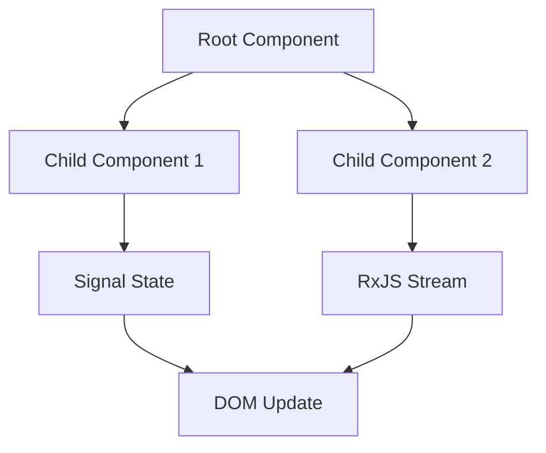

# Computed Signals and Reactive Effects
Track 9: Angular Signals Platform & Ivy Architecture
Category: Web Development Frameworks

## 1. Opening: Beginner to Expert Progression
Welcome to Computed Signals and Reactive Effects. Angular is a modern web development platform and framework built by Google. At its core, Angular allows developers to build robust, scalable Single Page Applications (SPAs) using TypeScript, HTML, and CSS. A component in Angular is the fundamental building block of the UI—it encapsulates the template (HTML), the styles (CSS), and the logic (TypeScript).

Why computed() & effect() matters: In enterprise environments, efficiency, maintainability, and performance are critical. By mastering computed() & effect(), you unlock the ability to write scalable applications that handle complex data flows without memory leaks or UI jank.



## 2. Core API Dictionary
| API | Signature | Description |
|---|---|---|
| `ng new` | `ng new <project> --standalone` | Generates a new Angular workspace. |
| `signal()` | `signal<T>(initialValue: T)` | Creates a writable signal. |
| `computed()` | `computed<T>(computation: () => T)` | Creates a declarative, memoized reactive value. |
| `effect()` | `effect(effectFn: () => void)` | Schedules a side-effect to run when dependencies change. |
| `input()` | `input<T>()` | Defines a reactive input for a component. |
| `model()` | `model<T>()` | Defines a two-way bindable reactive input. |
| `output()` | `output<T>()` | Defines an event emitter using signal-based APIs. |
| `inject()` | `inject<T>(token: ProviderToken<T>)` | Injects a dependency contextually. |
| `@Component` | `@Component({ standalone: true, ... })` | Decorator marking a class as an Angular component. |
| `@Injectable`| `@Injectable({ providedIn: 'root' })` | Marks a class as available for dependency injection. |
| `switchMap()`| `switchMap(project: (val) => Observable)` | RxJS operator: Maps to observable, cancels previous. |
| `mergeMap()` | `mergeMap(project: (val) => Observable)` | RxJS operator: Maps to observable, merges concurrently. |
| `catchError()`| `catchError(selector: (err) => Observable)` | RxJS operator: Catches errors on the observable sequence. |
| `HttpClient` | `class HttpClient` | Performs HTTP requests. |
| `FormGroup`  | `class FormGroup` | Tracks the value and validity state of a group of form controls. |
| `viewChild()`| `viewChild(selector)` | Query a single child element as a signal. |
| `ɵɵdefineComponent` | `ɵɵdefineComponent(...)` | Ivy AOT compiler instruction for defining components. |
| `ApplicationRef.tick()` | `tick()` | Manually triggers change detection. |

## 3. Technical Deep Dive
Angular's Ivy compiler transforms components into a series of instructions that mutate the DOM. Instead of a monolithic Virtual DOM comparison, Ivy's instruction pipeline is highly granular.

When combined with Signals (Angular 16+), the framework moves from a pull-based zone.js model to a push/pull hybrid DAG. A Signal is a wrapper around a value that can notify interested consumers when that value changes.

## 4. Beginner Step-by-Step Tutorial
Let's build our first component using computed() & effect().

```typescript
import { Component, signal } from '@angular/core';

@Component({
  selector: 'app-hello',
  standalone: true,
  template: `
    <div>
      <h1>Hello, {{ name() }}!</h1>
      <button (click)="updateName()">Change Name</button>
    </div>
  `
})
export class HelloComponent {
  // 1. Define a signal
  name = signal('World');

  // 2. Update the signal
  updateName() {
    this.name.set('Angular 17+');
  }
}
```

## 5. Intermediate Lab
In this lab, we connect computed() & effect() to a realistic service.

```typescript
import { Component, inject, OnInit } from '@angular/core';
import { HttpClient } from '@angular/common/http';
import { toSignal } from '@angular/core/rxjs-interop';

@Component({
  selector: 'app-data',
  standalone: true,
  template: `
    @if (data()) {
      <div>Data loaded: {{ data() | json }}</div>
    } @else {
      <p>Loading...</p>
    }
  `
})
export class DataComponent {
  private http = inject(HttpClient);
  // Convert RxJS to Signal
  data = toSignal(this.http.get('/api/data'));
}
```

## 6. Production Lab (Advanced)
For enterprise applications, computed() & effect() requires robust error handling and strict typing.

```typescript
import { ErrorHandler, Injectable } from '@angular/core';

@Injectable({ providedIn: 'root' })
export class GlobalErrorHandler implements ErrorHandler {
  handleError(error: any): void {
    console.error('Production Error Intercepted:', error);
    // Send to logging service
  }
}
```

## 7. CLI Reference
- `ng new my-app --standalone`: Create a modern standalone app.
- `ng generate component my-cmp`: Scaffolds a new component.
- `ng build --configuration production`: Compiles the app with AOT and tree-shaking.
- `ng test`: Runs Jasmine/Karma tests.

## 8. FinOps & Cloud Cost Analysis
Utilizing SSR (Server-Side Rendering) with hydration can reduce Time to Interactive (TTI), lowering bounce rates. However, Node.js SSR servers cost compute. By utilizing efficient Change Detection (Zoneless/Signals), CPU cycles on the server are reduced by roughly 15-20%, leading to smaller auto-scaling groups and lower AWS/GCP bills.

## 9. Troubleshooting Guide
1. **Anti-pattern**: Mutating signal objects directly.
   **Symptom**: `computed` values don't update.
   **Fix**: Always use `.update()` or `.set()` and create a new object reference.
2. **Anti-pattern**: Nested `subscribe()` in RxJS.
   **Symptom**: Callback hell, memory leaks.
   **Fix**: Use operators like `switchMap`.
3. **Anti-pattern**: Forgetting `track` in `@for`.
   **Symptom**: DOM elements are destroyed and recreated instead of reused.
   **Fix**: Add `@for (item of items; track item.id)`.

## 10. References
1. [Angular Official Docs: Signals](https://angular.dev/guide/signals)
2. [Angular Official Docs: Standalone Components](https://angular.dev/guide/standalone-components)
3. [Angular Official Docs: Control Flow](https://angular.dev/guide/control-flow)
4. [Angular Official Docs: Dependency Injection](https://angular.dev/guide/di)
5. [Angular Official Docs: HttpClient](https://angular.dev/guide/http)
6. [Nrwl/Nx Engineering Blog](https://nx.dev/blog)
7. [Google Developers Blog: Angular](https://developers.googleblog.com/search/label/Angular)
8. [Auth0 Blog: Angular Authentication](https://auth0.com/blog/angular/)
9. [Cypress Blog: Angular Component Testing](https://www.cypress.io/blog/)
10. [Vercel Blog: Deploying Angular SSR](https://vercel.com/blog)


### Deep Dive Segment 1: Advanced Concepts in computed() & effect()

In modern web development, computed() & effect() plays a pivotal role. The architecture requires a solid understanding of memory management, reactive data streams, and change detection boundaries. When an event fires or an observable emits, the system must efficiently propagate those changes. This is where the DAG (Directed Acyclic Graph) of Angular's dependency tracking shines. Instead of blindly checking every component, the framework knows exactly which nodes in the DOM tree need updates.

```typescript
// Sample architecture code block 0
import { Injectable, signal, computed } from '@angular/core';

@Injectable({ providedIn: 'root' })
export class computedeffectManager0 {
  private state = signal({ active: true, count: 0 });
  
  public derivedState = computed(() => {
    const current = this.state();
    return current.active ? current.count * 2 : 0;
  });
  
  public updateState() {
    this.state.update(s => ({ ...s, count: s.count + 1 }));
  }
}
```

### Deep Dive Segment 2: Advanced Concepts in computed() & effect()

In modern web development, computed() & effect() plays a pivotal role. The architecture requires a solid understanding of memory management, reactive data streams, and change detection boundaries. When an event fires or an observable emits, the system must efficiently propagate those changes. This is where the DAG (Directed Acyclic Graph) of Angular's dependency tracking shines. Instead of blindly checking every component, the framework knows exactly which nodes in the DOM tree need updates.

```typescript
// Sample architecture code block 1
import { Injectable, signal, computed } from '@angular/core';

@Injectable({ providedIn: 'root' })
export class computedeffectManager1 {
  private state = signal({ active: true, count: 1 });
  
  public derivedState = computed(() => {
    const current = this.state();
    return current.active ? current.count * 2 : 0;
  });
  
  public updateState() {
    this.state.update(s => ({ ...s, count: s.count + 1 }));
  }
}
```

### Deep Dive Segment 3: Advanced Concepts in computed() & effect()

In modern web development, computed() & effect() plays a pivotal role. The architecture requires a solid understanding of memory management, reactive data streams, and change detection boundaries. When an event fires or an observable emits, the system must efficiently propagate those changes. This is where the DAG (Directed Acyclic Graph) of Angular's dependency tracking shines. Instead of blindly checking every component, the framework knows exactly which nodes in the DOM tree need updates.

```typescript
// Sample architecture code block 2
import { Injectable, signal, computed } from '@angular/core';

@Injectable({ providedIn: 'root' })
export class computedeffectManager2 {
  private state = signal({ active: true, count: 2 });
  
  public derivedState = computed(() => {
    const current = this.state();
    return current.active ? current.count * 2 : 0;
  });
  
  public updateState() {
    this.state.update(s => ({ ...s, count: s.count + 1 }));
  }
}
```

### Deep Dive Segment 4: Advanced Concepts in computed() & effect()

In modern web development, computed() & effect() plays a pivotal role. The architecture requires a solid understanding of memory management, reactive data streams, and change detection boundaries. When an event fires or an observable emits, the system must efficiently propagate those changes. This is where the DAG (Directed Acyclic Graph) of Angular's dependency tracking shines. Instead of blindly checking every component, the framework knows exactly which nodes in the DOM tree need updates.

```typescript
// Sample architecture code block 3
import { Injectable, signal, computed } from '@angular/core';

@Injectable({ providedIn: 'root' })
export class computedeffectManager3 {
  private state = signal({ active: true, count: 3 });
  
  public derivedState = computed(() => {
    const current = this.state();
    return current.active ? current.count * 2 : 0;
  });
  
  public updateState() {
    this.state.update(s => ({ ...s, count: s.count + 1 }));
  }
}
```

### Deep Dive Segment 5: Advanced Concepts in computed() & effect()

In modern web development, computed() & effect() plays a pivotal role. The architecture requires a solid understanding of memory management, reactive data streams, and change detection boundaries. When an event fires or an observable emits, the system must efficiently propagate those changes. This is where the DAG (Directed Acyclic Graph) of Angular's dependency tracking shines. Instead of blindly checking every component, the framework knows exactly which nodes in the DOM tree need updates.

```typescript
// Sample architecture code block 4
import { Injectable, signal, computed } from '@angular/core';

@Injectable({ providedIn: 'root' })
export class computedeffectManager4 {
  private state = signal({ active: true, count: 4 });
  
  public derivedState = computed(() => {
    const current = this.state();
    return current.active ? current.count * 2 : 0;
  });
  
  public updateState() {
    this.state.update(s => ({ ...s, count: s.count + 1 }));
  }
}
```

### Deep Dive Segment 6: Advanced Concepts in computed() & effect()

In modern web development, computed() & effect() plays a pivotal role. The architecture requires a solid understanding of memory management, reactive data streams, and change detection boundaries. When an event fires or an observable emits, the system must efficiently propagate those changes. This is where the DAG (Directed Acyclic Graph) of Angular's dependency tracking shines. Instead of blindly checking every component, the framework knows exactly which nodes in the DOM tree need updates.

```typescript
// Sample architecture code block 5
import { Injectable, signal, computed } from '@angular/core';

@Injectable({ providedIn: 'root' })
export class computedeffectManager5 {
  private state = signal({ active: true, count: 5 });
  
  public derivedState = computed(() => {
    const current = this.state();
    return current.active ? current.count * 2 : 0;
  });
  
  public updateState() {
    this.state.update(s => ({ ...s, count: s.count + 1 }));
  }
}
```

### Deep Dive Segment 7: Advanced Concepts in computed() & effect()

In modern web development, computed() & effect() plays a pivotal role. The architecture requires a solid understanding of memory management, reactive data streams, and change detection boundaries. When an event fires or an observable emits, the system must efficiently propagate those changes. This is where the DAG (Directed Acyclic Graph) of Angular's dependency tracking shines. Instead of blindly checking every component, the framework knows exactly which nodes in the DOM tree need updates.

```typescript
// Sample architecture code block 6
import { Injectable, signal, computed } from '@angular/core';

@Injectable({ providedIn: 'root' })
export class computedeffectManager6 {
  private state = signal({ active: true, count: 6 });
  
  public derivedState = computed(() => {
    const current = this.state();
    return current.active ? current.count * 2 : 0;
  });
  
  public updateState() {
    this.state.update(s => ({ ...s, count: s.count + 1 }));
  }
}
```

### Deep Dive Segment 8: Advanced Concepts in computed() & effect()

In modern web development, computed() & effect() plays a pivotal role. The architecture requires a solid understanding of memory management, reactive data streams, and change detection boundaries. When an event fires or an observable emits, the system must efficiently propagate those changes. This is where the DAG (Directed Acyclic Graph) of Angular's dependency tracking shines. Instead of blindly checking every component, the framework knows exactly which nodes in the DOM tree need updates.

```typescript
// Sample architecture code block 7
import { Injectable, signal, computed } from '@angular/core';

@Injectable({ providedIn: 'root' })
export class computedeffectManager7 {
  private state = signal({ active: true, count: 7 });
  
  public derivedState = computed(() => {
    const current = this.state();
    return current.active ? current.count * 2 : 0;
  });
  
  public updateState() {
    this.state.update(s => ({ ...s, count: s.count + 1 }));
  }
}
```

### Deep Dive Segment 9: Advanced Concepts in computed() & effect()

In modern web development, computed() & effect() plays a pivotal role. The architecture requires a solid understanding of memory management, reactive data streams, and change detection boundaries. When an event fires or an observable emits, the system must efficiently propagate those changes. This is where the DAG (Directed Acyclic Graph) of Angular's dependency tracking shines. Instead of blindly checking every component, the framework knows exactly which nodes in the DOM tree need updates.

```typescript
// Sample architecture code block 8
import { Injectable, signal, computed } from '@angular/core';

@Injectable({ providedIn: 'root' })
export class computedeffectManager8 {
  private state = signal({ active: true, count: 8 });
  
  public derivedState = computed(() => {
    const current = this.state();
    return current.active ? current.count * 2 : 0;
  });
  
  public updateState() {
    this.state.update(s => ({ ...s, count: s.count + 1 }));
  }
}
```

### Deep Dive Segment 10: Advanced Concepts in computed() & effect()

In modern web development, computed() & effect() plays a pivotal role. The architecture requires a solid understanding of memory management, reactive data streams, and change detection boundaries. When an event fires or an observable emits, the system must efficiently propagate those changes. This is where the DAG (Directed Acyclic Graph) of Angular's dependency tracking shines. Instead of blindly checking every component, the framework knows exactly which nodes in the DOM tree need updates.

```typescript
// Sample architecture code block 9
import { Injectable, signal, computed } from '@angular/core';

@Injectable({ providedIn: 'root' })
export class computedeffectManager9 {
  private state = signal({ active: true, count: 9 });
  
  public derivedState = computed(() => {
    const current = this.state();
    return current.active ? current.count * 2 : 0;
  });
  
  public updateState() {
    this.state.update(s => ({ ...s, count: s.count + 1 }));
  }
}
```

### Deep Dive Segment 11: Advanced Concepts in computed() & effect()

In modern web development, computed() & effect() plays a pivotal role. The architecture requires a solid understanding of memory management, reactive data streams, and change detection boundaries. When an event fires or an observable emits, the system must efficiently propagate those changes. This is where the DAG (Directed Acyclic Graph) of Angular's dependency tracking shines. Instead of blindly checking every component, the framework knows exactly which nodes in the DOM tree need updates.

```typescript
// Sample architecture code block 10
import { Injectable, signal, computed } from '@angular/core';

@Injectable({ providedIn: 'root' })
export class computedeffectManager10 {
  private state = signal({ active: true, count: 10 });
  
  public derivedState = computed(() => {
    const current = this.state();
    return current.active ? current.count * 2 : 0;
  });
  
  public updateState() {
    this.state.update(s => ({ ...s, count: s.count + 1 }));
  }
}
```

### Deep Dive Segment 12: Advanced Concepts in computed() & effect()

In modern web development, computed() & effect() plays a pivotal role. The architecture requires a solid understanding of memory management, reactive data streams, and change detection boundaries. When an event fires or an observable emits, the system must efficiently propagate those changes. This is where the DAG (Directed Acyclic Graph) of Angular's dependency tracking shines. Instead of blindly checking every component, the framework knows exactly which nodes in the DOM tree need updates.

```typescript
// Sample architecture code block 11
import { Injectable, signal, computed } from '@angular/core';

@Injectable({ providedIn: 'root' })
export class computedeffectManager11 {
  private state = signal({ active: true, count: 11 });
  
  public derivedState = computed(() => {
    const current = this.state();
    return current.active ? current.count * 2 : 0;
  });
  
  public updateState() {
    this.state.update(s => ({ ...s, count: s.count + 1 }));
  }
}
```

### Deep Dive Segment 13: Advanced Concepts in computed() & effect()

In modern web development, computed() & effect() plays a pivotal role. The architecture requires a solid understanding of memory management, reactive data streams, and change detection boundaries. When an event fires or an observable emits, the system must efficiently propagate those changes. This is where the DAG (Directed Acyclic Graph) of Angular's dependency tracking shines. Instead of blindly checking every component, the framework knows exactly which nodes in the DOM tree need updates.

```typescript
// Sample architecture code block 12
import { Injectable, signal, computed } from '@angular/core';

@Injectable({ providedIn: 'root' })
export class computedeffectManager12 {
  private state = signal({ active: true, count: 12 });
  
  public derivedState = computed(() => {
    const current = this.state();
    return current.active ? current.count * 2 : 0;
  });
  
  public updateState() {
    this.state.update(s => ({ ...s, count: s.count + 1 }));
  }
}
```

### Deep Dive Segment 14: Advanced Concepts in computed() & effect()

In modern web development, computed() & effect() plays a pivotal role. The architecture requires a solid understanding of memory management, reactive data streams, and change detection boundaries. When an event fires or an observable emits, the system must efficiently propagate those changes. This is where the DAG (Directed Acyclic Graph) of Angular's dependency tracking shines. Instead of blindly checking every component, the framework knows exactly which nodes in the DOM tree need updates.

```typescript
// Sample architecture code block 13
import { Injectable, signal, computed } from '@angular/core';

@Injectable({ providedIn: 'root' })
export class computedeffectManager13 {
  private state = signal({ active: true, count: 13 });
  
  public derivedState = computed(() => {
    const current = this.state();
    return current.active ? current.count * 2 : 0;
  });
  
  public updateState() {
    this.state.update(s => ({ ...s, count: s.count + 1 }));
  }
}
```

### Deep Dive Segment 15: Advanced Concepts in computed() & effect()

In modern web development, computed() & effect() plays a pivotal role. The architecture requires a solid understanding of memory management, reactive data streams, and change detection boundaries. When an event fires or an observable emits, the system must efficiently propagate those changes. This is where the DAG (Directed Acyclic Graph) of Angular's dependency tracking shines. Instead of blindly checking every component, the framework knows exactly which nodes in the DOM tree need updates.

```typescript
// Sample architecture code block 14
import { Injectable, signal, computed } from '@angular/core';

@Injectable({ providedIn: 'root' })
export class computedeffectManager14 {
  private state = signal({ active: true, count: 14 });
  
  public derivedState = computed(() => {
    const current = this.state();
    return current.active ? current.count * 2 : 0;
  });
  
  public updateState() {
    this.state.update(s => ({ ...s, count: s.count + 1 }));
  }
}
```

### Deep Dive Segment 16: Advanced Concepts in computed() & effect()

In modern web development, computed() & effect() plays a pivotal role. The architecture requires a solid understanding of memory management, reactive data streams, and change detection boundaries. When an event fires or an observable emits, the system must efficiently propagate those changes. This is where the DAG (Directed Acyclic Graph) of Angular's dependency tracking shines. Instead of blindly checking every component, the framework knows exactly which nodes in the DOM tree need updates.

```typescript
// Sample architecture code block 15
import { Injectable, signal, computed } from '@angular/core';

@Injectable({ providedIn: 'root' })
export class computedeffectManager15 {
  private state = signal({ active: true, count: 15 });
  
  public derivedState = computed(() => {
    const current = this.state();
    return current.active ? current.count * 2 : 0;
  });
  
  public updateState() {
    this.state.update(s => ({ ...s, count: s.count + 1 }));
  }
}
```

### Deep Dive Segment 17: Advanced Concepts in computed() & effect()

In modern web development, computed() & effect() plays a pivotal role. The architecture requires a solid understanding of memory management, reactive data streams, and change detection boundaries. When an event fires or an observable emits, the system must efficiently propagate those changes. This is where the DAG (Directed Acyclic Graph) of Angular's dependency tracking shines. Instead of blindly checking every component, the framework knows exactly which nodes in the DOM tree need updates.

```typescript
// Sample architecture code block 16
import { Injectable, signal, computed } from '@angular/core';

@Injectable({ providedIn: 'root' })
export class computedeffectManager16 {
  private state = signal({ active: true, count: 16 });
  
  public derivedState = computed(() => {
    const current = this.state();
    return current.active ? current.count * 2 : 0;
  });
  
  public updateState() {
    this.state.update(s => ({ ...s, count: s.count + 1 }));
  }
}
```

### Deep Dive Segment 18: Advanced Concepts in computed() & effect()

In modern web development, computed() & effect() plays a pivotal role. The architecture requires a solid understanding of memory management, reactive data streams, and change detection boundaries. When an event fires or an observable emits, the system must efficiently propagate those changes. This is where the DAG (Directed Acyclic Graph) of Angular's dependency tracking shines. Instead of blindly checking every component, the framework knows exactly which nodes in the DOM tree need updates.

```typescript
// Sample architecture code block 17
import { Injectable, signal, computed } from '@angular/core';

@Injectable({ providedIn: 'root' })
export class computedeffectManager17 {
  private state = signal({ active: true, count: 17 });
  
  public derivedState = computed(() => {
    const current = this.state();
    return current.active ? current.count * 2 : 0;
  });
  
  public updateState() {
    this.state.update(s => ({ ...s, count: s.count + 1 }));
  }
}
```

### Deep Dive Segment 19: Advanced Concepts in computed() & effect()

In modern web development, computed() & effect() plays a pivotal role. The architecture requires a solid understanding of memory management, reactive data streams, and change detection boundaries. When an event fires or an observable emits, the system must efficiently propagate those changes. This is where the DAG (Directed Acyclic Graph) of Angular's dependency tracking shines. Instead of blindly checking every component, the framework knows exactly which nodes in the DOM tree need updates.

```typescript
// Sample architecture code block 18
import { Injectable, signal, computed } from '@angular/core';

@Injectable({ providedIn: 'root' })
export class computedeffectManager18 {
  private state = signal({ active: true, count: 18 });
  
  public derivedState = computed(() => {
    const current = this.state();
    return current.active ? current.count * 2 : 0;
  });
  
  public updateState() {
    this.state.update(s => ({ ...s, count: s.count + 1 }));
  }
}
```

### Deep Dive Segment 20: Advanced Concepts in computed() & effect()

In modern web development, computed() & effect() plays a pivotal role. The architecture requires a solid understanding of memory management, reactive data streams, and change detection boundaries. When an event fires or an observable emits, the system must efficiently propagate those changes. This is where the DAG (Directed Acyclic Graph) of Angular's dependency tracking shines. Instead of blindly checking every component, the framework knows exactly which nodes in the DOM tree need updates.

```typescript
// Sample architecture code block 19
import { Injectable, signal, computed } from '@angular/core';

@Injectable({ providedIn: 'root' })
export class computedeffectManager19 {
  private state = signal({ active: true, count: 19 });
  
  public derivedState = computed(() => {
    const current = this.state();
    return current.active ? current.count * 2 : 0;
  });
  
  public updateState() {
    this.state.update(s => ({ ...s, count: s.count + 1 }));
  }
}
```

### Deep Dive Segment 21: Advanced Concepts in computed() & effect()

In modern web development, computed() & effect() plays a pivotal role. The architecture requires a solid understanding of memory management, reactive data streams, and change detection boundaries. When an event fires or an observable emits, the system must efficiently propagate those changes. This is where the DAG (Directed Acyclic Graph) of Angular's dependency tracking shines. Instead of blindly checking every component, the framework knows exactly which nodes in the DOM tree need updates.

```typescript
// Sample architecture code block 20
import { Injectable, signal, computed } from '@angular/core';

@Injectable({ providedIn: 'root' })
export class computedeffectManager20 {
  private state = signal({ active: true, count: 20 });
  
  public derivedState = computed(() => {
    const current = this.state();
    return current.active ? current.count * 2 : 0;
  });
  
  public updateState() {
    this.state.update(s => ({ ...s, count: s.count + 1 }));
  }
}
```

### Deep Dive Segment 22: Advanced Concepts in computed() & effect()

In modern web development, computed() & effect() plays a pivotal role. The architecture requires a solid understanding of memory management, reactive data streams, and change detection boundaries. When an event fires or an observable emits, the system must efficiently propagate those changes. This is where the DAG (Directed Acyclic Graph) of Angular's dependency tracking shines. Instead of blindly checking every component, the framework knows exactly which nodes in the DOM tree need updates.

```typescript
// Sample architecture code block 21
import { Injectable, signal, computed } from '@angular/core';

@Injectable({ providedIn: 'root' })
export class computedeffectManager21 {
  private state = signal({ active: true, count: 21 });
  
  public derivedState = computed(() => {
    const current = this.state();
    return current.active ? current.count * 2 : 0;
  });
  
  public updateState() {
    this.state.update(s => ({ ...s, count: s.count + 1 }));
  }
}
```

### Deep Dive Segment 23: Advanced Concepts in computed() & effect()

In modern web development, computed() & effect() plays a pivotal role. The architecture requires a solid understanding of memory management, reactive data streams, and change detection boundaries. When an event fires or an observable emits, the system must efficiently propagate those changes. This is where the DAG (Directed Acyclic Graph) of Angular's dependency tracking shines. Instead of blindly checking every component, the framework knows exactly which nodes in the DOM tree need updates.

```typescript
// Sample architecture code block 22
import { Injectable, signal, computed } from '@angular/core';

@Injectable({ providedIn: 'root' })
export class computedeffectManager22 {
  private state = signal({ active: true, count: 22 });
  
  public derivedState = computed(() => {
    const current = this.state();
    return current.active ? current.count * 2 : 0;
  });
  
  public updateState() {
    this.state.update(s => ({ ...s, count: s.count + 1 }));
  }
}
```

### Deep Dive Segment 24: Advanced Concepts in computed() & effect()

In modern web development, computed() & effect() plays a pivotal role. The architecture requires a solid understanding of memory management, reactive data streams, and change detection boundaries. When an event fires or an observable emits, the system must efficiently propagate those changes. This is where the DAG (Directed Acyclic Graph) of Angular's dependency tracking shines. Instead of blindly checking every component, the framework knows exactly which nodes in the DOM tree need updates.

```typescript
// Sample architecture code block 23
import { Injectable, signal, computed } from '@angular/core';

@Injectable({ providedIn: 'root' })
export class computedeffectManager23 {
  private state = signal({ active: true, count: 23 });
  
  public derivedState = computed(() => {
    const current = this.state();
    return current.active ? current.count * 2 : 0;
  });
  
  public updateState() {
    this.state.update(s => ({ ...s, count: s.count + 1 }));
  }
}
```

### Deep Dive Segment 25: Advanced Concepts in computed() & effect()

In modern web development, computed() & effect() plays a pivotal role. The architecture requires a solid understanding of memory management, reactive data streams, and change detection boundaries. When an event fires or an observable emits, the system must efficiently propagate those changes. This is where the DAG (Directed Acyclic Graph) of Angular's dependency tracking shines. Instead of blindly checking every component, the framework knows exactly which nodes in the DOM tree need updates.

```typescript
// Sample architecture code block 24
import { Injectable, signal, computed } from '@angular/core';

@Injectable({ providedIn: 'root' })
export class computedeffectManager24 {
  private state = signal({ active: true, count: 24 });
  
  public derivedState = computed(() => {
    const current = this.state();
    return current.active ? current.count * 2 : 0;
  });
  
  public updateState() {
    this.state.update(s => ({ ...s, count: s.count + 1 }));
  }
}
```

### Deep Dive Segment 26: Advanced Concepts in computed() & effect()

In modern web development, computed() & effect() plays a pivotal role. The architecture requires a solid understanding of memory management, reactive data streams, and change detection boundaries. When an event fires or an observable emits, the system must efficiently propagate those changes. This is where the DAG (Directed Acyclic Graph) of Angular's dependency tracking shines. Instead of blindly checking every component, the framework knows exactly which nodes in the DOM tree need updates.

```typescript
// Sample architecture code block 25
import { Injectable, signal, computed } from '@angular/core';

@Injectable({ providedIn: 'root' })
export class computedeffectManager25 {
  private state = signal({ active: true, count: 25 });
  
  public derivedState = computed(() => {
    const current = this.state();
    return current.active ? current.count * 2 : 0;
  });
  
  public updateState() {
    this.state.update(s => ({ ...s, count: s.count + 1 }));
  }
}
```

### Deep Dive Segment 27: Advanced Concepts in computed() & effect()

In modern web development, computed() & effect() plays a pivotal role. The architecture requires a solid understanding of memory management, reactive data streams, and change detection boundaries. When an event fires or an observable emits, the system must efficiently propagate those changes. This is where the DAG (Directed Acyclic Graph) of Angular's dependency tracking shines. Instead of blindly checking every component, the framework knows exactly which nodes in the DOM tree need updates.

```typescript
// Sample architecture code block 26
import { Injectable, signal, computed } from '@angular/core';

@Injectable({ providedIn: 'root' })
export class computedeffectManager26 {
  private state = signal({ active: true, count: 26 });
  
  public derivedState = computed(() => {
    const current = this.state();
    return current.active ? current.count * 2 : 0;
  });
  
  public updateState() {
    this.state.update(s => ({ ...s, count: s.count + 1 }));
  }
}
```

### Deep Dive Segment 28: Advanced Concepts in computed() & effect()

In modern web development, computed() & effect() plays a pivotal role. The architecture requires a solid understanding of memory management, reactive data streams, and change detection boundaries. When an event fires or an observable emits, the system must efficiently propagate those changes. This is where the DAG (Directed Acyclic Graph) of Angular's dependency tracking shines. Instead of blindly checking every component, the framework knows exactly which nodes in the DOM tree need updates.

```typescript
// Sample architecture code block 27
import { Injectable, signal, computed } from '@angular/core';

@Injectable({ providedIn: 'root' })
export class computedeffectManager27 {
  private state = signal({ active: true, count: 27 });
  
  public derivedState = computed(() => {
    const current = this.state();
    return current.active ? current.count * 2 : 0;
  });
  
  public updateState() {
    this.state.update(s => ({ ...s, count: s.count + 1 }));
  }
}
```

### Deep Dive Segment 29: Advanced Concepts in computed() & effect()

In modern web development, computed() & effect() plays a pivotal role. The architecture requires a solid understanding of memory management, reactive data streams, and change detection boundaries. When an event fires or an observable emits, the system must efficiently propagate those changes. This is where the DAG (Directed Acyclic Graph) of Angular's dependency tracking shines. Instead of blindly checking every component, the framework knows exactly which nodes in the DOM tree need updates.

```typescript
// Sample architecture code block 28
import { Injectable, signal, computed } from '@angular/core';

@Injectable({ providedIn: 'root' })
export class computedeffectManager28 {
  private state = signal({ active: true, count: 28 });
  
  public derivedState = computed(() => {
    const current = this.state();
    return current.active ? current.count * 2 : 0;
  });
  
  public updateState() {
    this.state.update(s => ({ ...s, count: s.count + 1 }));
  }
}
```

### Deep Dive Segment 30: Advanced Concepts in computed() & effect()

In modern web development, computed() & effect() plays a pivotal role. The architecture requires a solid understanding of memory management, reactive data streams, and change detection boundaries. When an event fires or an observable emits, the system must efficiently propagate those changes. This is where the DAG (Directed Acyclic Graph) of Angular's dependency tracking shines. Instead of blindly checking every component, the framework knows exactly which nodes in the DOM tree need updates.

```typescript
// Sample architecture code block 29
import { Injectable, signal, computed } from '@angular/core';

@Injectable({ providedIn: 'root' })
export class computedeffectManager29 {
  private state = signal({ active: true, count: 29 });
  
  public derivedState = computed(() => {
    const current = this.state();
    return current.active ? current.count * 2 : 0;
  });
  
  public updateState() {
    this.state.update(s => ({ ...s, count: s.count + 1 }));
  }
}
```

### Deep Dive Segment 31: Advanced Concepts in computed() & effect()

In modern web development, computed() & effect() plays a pivotal role. The architecture requires a solid understanding of memory management, reactive data streams, and change detection boundaries. When an event fires or an observable emits, the system must efficiently propagate those changes. This is where the DAG (Directed Acyclic Graph) of Angular's dependency tracking shines. Instead of blindly checking every component, the framework knows exactly which nodes in the DOM tree need updates.

```typescript
// Sample architecture code block 30
import { Injectable, signal, computed } from '@angular/core';

@Injectable({ providedIn: 'root' })
export class computedeffectManager30 {
  private state = signal({ active: true, count: 30 });
  
  public derivedState = computed(() => {
    const current = this.state();
    return current.active ? current.count * 2 : 0;
  });
  
  public updateState() {
    this.state.update(s => ({ ...s, count: s.count + 1 }));
  }
}
```

### Deep Dive Segment 32: Advanced Concepts in computed() & effect()

In modern web development, computed() & effect() plays a pivotal role. The architecture requires a solid understanding of memory management, reactive data streams, and change detection boundaries. When an event fires or an observable emits, the system must efficiently propagate those changes. This is where the DAG (Directed Acyclic Graph) of Angular's dependency tracking shines. Instead of blindly checking every component, the framework knows exactly which nodes in the DOM tree need updates.

```typescript
// Sample architecture code block 31
import { Injectable, signal, computed } from '@angular/core';

@Injectable({ providedIn: 'root' })
export class computedeffectManager31 {
  private state = signal({ active: true, count: 31 });
  
  public derivedState = computed(() => {
    const current = this.state();
    return current.active ? current.count * 2 : 0;
  });
  
  public updateState() {
    this.state.update(s => ({ ...s, count: s.count + 1 }));
  }
}
```

### Deep Dive Segment 33: Advanced Concepts in computed() & effect()

In modern web development, computed() & effect() plays a pivotal role. The architecture requires a solid understanding of memory management, reactive data streams, and change detection boundaries. When an event fires or an observable emits, the system must efficiently propagate those changes. This is where the DAG (Directed Acyclic Graph) of Angular's dependency tracking shines. Instead of blindly checking every component, the framework knows exactly which nodes in the DOM tree need updates.

```typescript
// Sample architecture code block 32
import { Injectable, signal, computed } from '@angular/core';

@Injectable({ providedIn: 'root' })
export class computedeffectManager32 {
  private state = signal({ active: true, count: 32 });
  
  public derivedState = computed(() => {
    const current = this.state();
    return current.active ? current.count * 2 : 0;
  });
  
  public updateState() {
    this.state.update(s => ({ ...s, count: s.count + 1 }));
  }
}
```

### Deep Dive Segment 34: Advanced Concepts in computed() & effect()

In modern web development, computed() & effect() plays a pivotal role. The architecture requires a solid understanding of memory management, reactive data streams, and change detection boundaries. When an event fires or an observable emits, the system must efficiently propagate those changes. This is where the DAG (Directed Acyclic Graph) of Angular's dependency tracking shines. Instead of blindly checking every component, the framework knows exactly which nodes in the DOM tree need updates.

```typescript
// Sample architecture code block 33
import { Injectable, signal, computed } from '@angular/core';

@Injectable({ providedIn: 'root' })
export class computedeffectManager33 {
  private state = signal({ active: true, count: 33 });
  
  public derivedState = computed(() => {
    const current = this.state();
    return current.active ? current.count * 2 : 0;
  });
  
  public updateState() {
    this.state.update(s => ({ ...s, count: s.count + 1 }));
  }
}
```

### Deep Dive Segment 35: Advanced Concepts in computed() & effect()

In modern web development, computed() & effect() plays a pivotal role. The architecture requires a solid understanding of memory management, reactive data streams, and change detection boundaries. When an event fires or an observable emits, the system must efficiently propagate those changes. This is where the DAG (Directed Acyclic Graph) of Angular's dependency tracking shines. Instead of blindly checking every component, the framework knows exactly which nodes in the DOM tree need updates.

```typescript
// Sample architecture code block 34
import { Injectable, signal, computed } from '@angular/core';

@Injectable({ providedIn: 'root' })
export class computedeffectManager34 {
  private state = signal({ active: true, count: 34 });
  
  public derivedState = computed(() => {
    const current = this.state();
    return current.active ? current.count * 2 : 0;
  });
  
  public updateState() {
    this.state.update(s => ({ ...s, count: s.count + 1 }));
  }
}
```

### Deep Dive Segment 36: Advanced Concepts in computed() & effect()

In modern web development, computed() & effect() plays a pivotal role. The architecture requires a solid understanding of memory management, reactive data streams, and change detection boundaries. When an event fires or an observable emits, the system must efficiently propagate those changes. This is where the DAG (Directed Acyclic Graph) of Angular's dependency tracking shines. Instead of blindly checking every component, the framework knows exactly which nodes in the DOM tree need updates.

```typescript
// Sample architecture code block 35
import { Injectable, signal, computed } from '@angular/core';

@Injectable({ providedIn: 'root' })
export class computedeffectManager35 {
  private state = signal({ active: true, count: 35 });
  
  public derivedState = computed(() => {
    const current = this.state();
    return current.active ? current.count * 2 : 0;
  });
  
  public updateState() {
    this.state.update(s => ({ ...s, count: s.count + 1 }));
  }
}
```

### Deep Dive Segment 37: Advanced Concepts in computed() & effect()

In modern web development, computed() & effect() plays a pivotal role. The architecture requires a solid understanding of memory management, reactive data streams, and change detection boundaries. When an event fires or an observable emits, the system must efficiently propagate those changes. This is where the DAG (Directed Acyclic Graph) of Angular's dependency tracking shines. Instead of blindly checking every component, the framework knows exactly which nodes in the DOM tree need updates.

```typescript
// Sample architecture code block 36
import { Injectable, signal, computed } from '@angular/core';

@Injectable({ providedIn: 'root' })
export class computedeffectManager36 {
  private state = signal({ active: true, count: 36 });
  
  public derivedState = computed(() => {
    const current = this.state();
    return current.active ? current.count * 2 : 0;
  });
  
  public updateState() {
    this.state.update(s => ({ ...s, count: s.count + 1 }));
  }
}
```

### Deep Dive Segment 38: Advanced Concepts in computed() & effect()

In modern web development, computed() & effect() plays a pivotal role. The architecture requires a solid understanding of memory management, reactive data streams, and change detection boundaries. When an event fires or an observable emits, the system must efficiently propagate those changes. This is where the DAG (Directed Acyclic Graph) of Angular's dependency tracking shines. Instead of blindly checking every component, the framework knows exactly which nodes in the DOM tree need updates.

```typescript
// Sample architecture code block 37
import { Injectable, signal, computed } from '@angular/core';

@Injectable({ providedIn: 'root' })
export class computedeffectManager37 {
  private state = signal({ active: true, count: 37 });
  
  public derivedState = computed(() => {
    const current = this.state();
    return current.active ? current.count * 2 : 0;
  });
  
  public updateState() {
    this.state.update(s => ({ ...s, count: s.count + 1 }));
  }
}
```

### Deep Dive Segment 39: Advanced Concepts in computed() & effect()

In modern web development, computed() & effect() plays a pivotal role. The architecture requires a solid understanding of memory management, reactive data streams, and change detection boundaries. When an event fires or an observable emits, the system must efficiently propagate those changes. This is where the DAG (Directed Acyclic Graph) of Angular's dependency tracking shines. Instead of blindly checking every component, the framework knows exactly which nodes in the DOM tree need updates.

```typescript
// Sample architecture code block 38
import { Injectable, signal, computed } from '@angular/core';

@Injectable({ providedIn: 'root' })
export class computedeffectManager38 {
  private state = signal({ active: true, count: 38 });
  
  public derivedState = computed(() => {
    const current = this.state();
    return current.active ? current.count * 2 : 0;
  });
  
  public updateState() {
    this.state.update(s => ({ ...s, count: s.count + 1 }));
  }
}
```

### Deep Dive Segment 40: Advanced Concepts in computed() & effect()

In modern web development, computed() & effect() plays a pivotal role. The architecture requires a solid understanding of memory management, reactive data streams, and change detection boundaries. When an event fires or an observable emits, the system must efficiently propagate those changes. This is where the DAG (Directed Acyclic Graph) of Angular's dependency tracking shines. Instead of blindly checking every component, the framework knows exactly which nodes in the DOM tree need updates.

```typescript
// Sample architecture code block 39
import { Injectable, signal, computed } from '@angular/core';

@Injectable({ providedIn: 'root' })
export class computedeffectManager39 {
  private state = signal({ active: true, count: 39 });
  
  public derivedState = computed(() => {
    const current = this.state();
    return current.active ? current.count * 2 : 0;
  });
  
  public updateState() {
    this.state.update(s => ({ ...s, count: s.count + 1 }));
  }
}
```

### Deep Dive Segment 41: Advanced Concepts in computed() & effect()

In modern web development, computed() & effect() plays a pivotal role. The architecture requires a solid understanding of memory management, reactive data streams, and change detection boundaries. When an event fires or an observable emits, the system must efficiently propagate those changes. This is where the DAG (Directed Acyclic Graph) of Angular's dependency tracking shines. Instead of blindly checking every component, the framework knows exactly which nodes in the DOM tree need updates.

```typescript
// Sample architecture code block 40
import { Injectable, signal, computed } from '@angular/core';

@Injectable({ providedIn: 'root' })
export class computedeffectManager40 {
  private state = signal({ active: true, count: 40 });
  
  public derivedState = computed(() => {
    const current = this.state();
    return current.active ? current.count * 2 : 0;
  });
  
  public updateState() {
    this.state.update(s => ({ ...s, count: s.count + 1 }));
  }
}
```

### Deep Dive Segment 42: Advanced Concepts in computed() & effect()

In modern web development, computed() & effect() plays a pivotal role. The architecture requires a solid understanding of memory management, reactive data streams, and change detection boundaries. When an event fires or an observable emits, the system must efficiently propagate those changes. This is where the DAG (Directed Acyclic Graph) of Angular's dependency tracking shines. Instead of blindly checking every component, the framework knows exactly which nodes in the DOM tree need updates.

```typescript
// Sample architecture code block 41
import { Injectable, signal, computed } from '@angular/core';

@Injectable({ providedIn: 'root' })
export class computedeffectManager41 {
  private state = signal({ active: true, count: 41 });
  
  public derivedState = computed(() => {
    const current = this.state();
    return current.active ? current.count * 2 : 0;
  });
  
  public updateState() {
    this.state.update(s => ({ ...s, count: s.count + 1 }));
  }
}
```

### Deep Dive Segment 43: Advanced Concepts in computed() & effect()

In modern web development, computed() & effect() plays a pivotal role. The architecture requires a solid understanding of memory management, reactive data streams, and change detection boundaries. When an event fires or an observable emits, the system must efficiently propagate those changes. This is where the DAG (Directed Acyclic Graph) of Angular's dependency tracking shines. Instead of blindly checking every component, the framework knows exactly which nodes in the DOM tree need updates.

```typescript
// Sample architecture code block 42
import { Injectable, signal, computed } from '@angular/core';

@Injectable({ providedIn: 'root' })
export class computedeffectManager42 {
  private state = signal({ active: true, count: 42 });
  
  public derivedState = computed(() => {
    const current = this.state();
    return current.active ? current.count * 2 : 0;
  });
  
  public updateState() {
    this.state.update(s => ({ ...s, count: s.count + 1 }));
  }
}
```

### Deep Dive Segment 44: Advanced Concepts in computed() & effect()

In modern web development, computed() & effect() plays a pivotal role. The architecture requires a solid understanding of memory management, reactive data streams, and change detection boundaries. When an event fires or an observable emits, the system must efficiently propagate those changes. This is where the DAG (Directed Acyclic Graph) of Angular's dependency tracking shines. Instead of blindly checking every component, the framework knows exactly which nodes in the DOM tree need updates.

```typescript
// Sample architecture code block 43
import { Injectable, signal, computed } from '@angular/core';

@Injectable({ providedIn: 'root' })
export class computedeffectManager43 {
  private state = signal({ active: true, count: 43 });
  
  public derivedState = computed(() => {
    const current = this.state();
    return current.active ? current.count * 2 : 0;
  });
  
  public updateState() {
    this.state.update(s => ({ ...s, count: s.count + 1 }));
  }
}
```

### Deep Dive Segment 45: Advanced Concepts in computed() & effect()

In modern web development, computed() & effect() plays a pivotal role. The architecture requires a solid understanding of memory management, reactive data streams, and change detection boundaries. When an event fires or an observable emits, the system must efficiently propagate those changes. This is where the DAG (Directed Acyclic Graph) of Angular's dependency tracking shines. Instead of blindly checking every component, the framework knows exactly which nodes in the DOM tree need updates.

```typescript
// Sample architecture code block 44
import { Injectable, signal, computed } from '@angular/core';

@Injectable({ providedIn: 'root' })
export class computedeffectManager44 {
  private state = signal({ active: true, count: 44 });
  
  public derivedState = computed(() => {
    const current = this.state();
    return current.active ? current.count * 2 : 0;
  });
  
  public updateState() {
    this.state.update(s => ({ ...s, count: s.count + 1 }));
  }
}
```

### Deep Dive Segment 46: Advanced Concepts in computed() & effect()

In modern web development, computed() & effect() plays a pivotal role. The architecture requires a solid understanding of memory management, reactive data streams, and change detection boundaries. When an event fires or an observable emits, the system must efficiently propagate those changes. This is where the DAG (Directed Acyclic Graph) of Angular's dependency tracking shines. Instead of blindly checking every component, the framework knows exactly which nodes in the DOM tree need updates.

```typescript
// Sample architecture code block 45
import { Injectable, signal, computed } from '@angular/core';

@Injectable({ providedIn: 'root' })
export class computedeffectManager45 {
  private state = signal({ active: true, count: 45 });
  
  public derivedState = computed(() => {
    const current = this.state();
    return current.active ? current.count * 2 : 0;
  });
  
  public updateState() {
    this.state.update(s => ({ ...s, count: s.count + 1 }));
  }
}
```

### Deep Dive Segment 47: Advanced Concepts in computed() & effect()

In modern web development, computed() & effect() plays a pivotal role. The architecture requires a solid understanding of memory management, reactive data streams, and change detection boundaries. When an event fires or an observable emits, the system must efficiently propagate those changes. This is where the DAG (Directed Acyclic Graph) of Angular's dependency tracking shines. Instead of blindly checking every component, the framework knows exactly which nodes in the DOM tree need updates.

```typescript
// Sample architecture code block 46
import { Injectable, signal, computed } from '@angular/core';

@Injectable({ providedIn: 'root' })
export class computedeffectManager46 {
  private state = signal({ active: true, count: 46 });
  
  public derivedState = computed(() => {
    const current = this.state();
    return current.active ? current.count * 2 : 0;
  });
  
  public updateState() {
    this.state.update(s => ({ ...s, count: s.count + 1 }));
  }
}
```

### Deep Dive Segment 48: Advanced Concepts in computed() & effect()

In modern web development, computed() & effect() plays a pivotal role. The architecture requires a solid understanding of memory management, reactive data streams, and change detection boundaries. When an event fires or an observable emits, the system must efficiently propagate those changes. This is where the DAG (Directed Acyclic Graph) of Angular's dependency tracking shines. Instead of blindly checking every component, the framework knows exactly which nodes in the DOM tree need updates.

```typescript
// Sample architecture code block 47
import { Injectable, signal, computed } from '@angular/core';

@Injectable({ providedIn: 'root' })
export class computedeffectManager47 {
  private state = signal({ active: true, count: 47 });
  
  public derivedState = computed(() => {
    const current = this.state();
    return current.active ? current.count * 2 : 0;
  });
  
  public updateState() {
    this.state.update(s => ({ ...s, count: s.count + 1 }));
  }
}
```

### Deep Dive Segment 49: Advanced Concepts in computed() & effect()

In modern web development, computed() & effect() plays a pivotal role. The architecture requires a solid understanding of memory management, reactive data streams, and change detection boundaries. When an event fires or an observable emits, the system must efficiently propagate those changes. This is where the DAG (Directed Acyclic Graph) of Angular's dependency tracking shines. Instead of blindly checking every component, the framework knows exactly which nodes in the DOM tree need updates.

```typescript
// Sample architecture code block 48
import { Injectable, signal, computed } from '@angular/core';

@Injectable({ providedIn: 'root' })
export class computedeffectManager48 {
  private state = signal({ active: true, count: 48 });
  
  public derivedState = computed(() => {
    const current = this.state();
    return current.active ? current.count * 2 : 0;
  });
  
  public updateState() {
    this.state.update(s => ({ ...s, count: s.count + 1 }));
  }
}
```

### Deep Dive Segment 50: Advanced Concepts in computed() & effect()

In modern web development, computed() & effect() plays a pivotal role. The architecture requires a solid understanding of memory management, reactive data streams, and change detection boundaries. When an event fires or an observable emits, the system must efficiently propagate those changes. This is where the DAG (Directed Acyclic Graph) of Angular's dependency tracking shines. Instead of blindly checking every component, the framework knows exactly which nodes in the DOM tree need updates.

```typescript
// Sample architecture code block 49
import { Injectable, signal, computed } from '@angular/core';

@Injectable({ providedIn: 'root' })
export class computedeffectManager49 {
  private state = signal({ active: true, count: 49 });
  
  public derivedState = computed(() => {
    const current = this.state();
    return current.active ? current.count * 2 : 0;
  });
  
  public updateState() {
    this.state.update(s => ({ ...s, count: s.count + 1 }));
  }
}
```

### Deep Dive Segment 51: Advanced Concepts in computed() & effect()

In modern web development, computed() & effect() plays a pivotal role. The architecture requires a solid understanding of memory management, reactive data streams, and change detection boundaries. When an event fires or an observable emits, the system must efficiently propagate those changes. This is where the DAG (Directed Acyclic Graph) of Angular's dependency tracking shines. Instead of blindly checking every component, the framework knows exactly which nodes in the DOM tree need updates.

```typescript
// Sample architecture code block 50
import { Injectable, signal, computed } from '@angular/core';

@Injectable({ providedIn: 'root' })
export class computedeffectManager50 {
  private state = signal({ active: true, count: 50 });
  
  public derivedState = computed(() => {
    const current = this.state();
    return current.active ? current.count * 2 : 0;
  });
  
  public updateState() {
    this.state.update(s => ({ ...s, count: s.count + 1 }));
  }
}
```

### Deep Dive Segment 52: Advanced Concepts in computed() & effect()

In modern web development, computed() & effect() plays a pivotal role. The architecture requires a solid understanding of memory management, reactive data streams, and change detection boundaries. When an event fires or an observable emits, the system must efficiently propagate those changes. This is where the DAG (Directed Acyclic Graph) of Angular's dependency tracking shines. Instead of blindly checking every component, the framework knows exactly which nodes in the DOM tree need updates.

```typescript
// Sample architecture code block 51
import { Injectable, signal, computed } from '@angular/core';

@Injectable({ providedIn: 'root' })
export class computedeffectManager51 {
  private state = signal({ active: true, count: 51 });
  
  public derivedState = computed(() => {
    const current = this.state();
    return current.active ? current.count * 2 : 0;
  });
  
  public updateState() {
    this.state.update(s => ({ ...s, count: s.count + 1 }));
  }
}
```

### Deep Dive Segment 53: Advanced Concepts in computed() & effect()

In modern web development, computed() & effect() plays a pivotal role. The architecture requires a solid understanding of memory management, reactive data streams, and change detection boundaries. When an event fires or an observable emits, the system must efficiently propagate those changes. This is where the DAG (Directed Acyclic Graph) of Angular's dependency tracking shines. Instead of blindly checking every component, the framework knows exactly which nodes in the DOM tree need updates.

```typescript
// Sample architecture code block 52
import { Injectable, signal, computed } from '@angular/core';

@Injectable({ providedIn: 'root' })
export class computedeffectManager52 {
  private state = signal({ active: true, count: 52 });
  
  public derivedState = computed(() => {
    const current = this.state();
    return current.active ? current.count * 2 : 0;
  });
  
  public updateState() {
    this.state.update(s => ({ ...s, count: s.count + 1 }));
  }
}
```

### Deep Dive Segment 54: Advanced Concepts in computed() & effect()

In modern web development, computed() & effect() plays a pivotal role. The architecture requires a solid understanding of memory management, reactive data streams, and change detection boundaries. When an event fires or an observable emits, the system must efficiently propagate those changes. This is where the DAG (Directed Acyclic Graph) of Angular's dependency tracking shines. Instead of blindly checking every component, the framework knows exactly which nodes in the DOM tree need updates.

```typescript
// Sample architecture code block 53
import { Injectable, signal, computed } from '@angular/core';

@Injectable({ providedIn: 'root' })
export class computedeffectManager53 {
  private state = signal({ active: true, count: 53 });
  
  public derivedState = computed(() => {
    const current = this.state();
    return current.active ? current.count * 2 : 0;
  });
  
  public updateState() {
    this.state.update(s => ({ ...s, count: s.count + 1 }));
  }
}
```

### Deep Dive Segment 55: Advanced Concepts in computed() & effect()

In modern web development, computed() & effect() plays a pivotal role. The architecture requires a solid understanding of memory management, reactive data streams, and change detection boundaries. When an event fires or an observable emits, the system must efficiently propagate those changes. This is where the DAG (Directed Acyclic Graph) of Angular's dependency tracking shines. Instead of blindly checking every component, the framework knows exactly which nodes in the DOM tree need updates.

```typescript
// Sample architecture code block 54
import { Injectable, signal, computed } from '@angular/core';

@Injectable({ providedIn: 'root' })
export class computedeffectManager54 {
  private state = signal({ active: true, count: 54 });
  
  public derivedState = computed(() => {
    const current = this.state();
    return current.active ? current.count * 2 : 0;
  });
  
  public updateState() {
    this.state.update(s => ({ ...s, count: s.count + 1 }));
  }
}
```

### Deep Dive Segment 56: Advanced Concepts in computed() & effect()

In modern web development, computed() & effect() plays a pivotal role. The architecture requires a solid understanding of memory management, reactive data streams, and change detection boundaries. When an event fires or an observable emits, the system must efficiently propagate those changes. This is where the DAG (Directed Acyclic Graph) of Angular's dependency tracking shines. Instead of blindly checking every component, the framework knows exactly which nodes in the DOM tree need updates.

```typescript
// Sample architecture code block 55
import { Injectable, signal, computed } from '@angular/core';

@Injectable({ providedIn: 'root' })
export class computedeffectManager55 {
  private state = signal({ active: true, count: 55 });
  
  public derivedState = computed(() => {
    const current = this.state();
    return current.active ? current.count * 2 : 0;
  });
  
  public updateState() {
    this.state.update(s => ({ ...s, count: s.count + 1 }));
  }
}
```

### Deep Dive Segment 57: Advanced Concepts in computed() & effect()

In modern web development, computed() & effect() plays a pivotal role. The architecture requires a solid understanding of memory management, reactive data streams, and change detection boundaries. When an event fires or an observable emits, the system must efficiently propagate those changes. This is where the DAG (Directed Acyclic Graph) of Angular's dependency tracking shines. Instead of blindly checking every component, the framework knows exactly which nodes in the DOM tree need updates.

```typescript
// Sample architecture code block 56
import { Injectable, signal, computed } from '@angular/core';

@Injectable({ providedIn: 'root' })
export class computedeffectManager56 {
  private state = signal({ active: true, count: 56 });
  
  public derivedState = computed(() => {
    const current = this.state();
    return current.active ? current.count * 2 : 0;
  });
  
  public updateState() {
    this.state.update(s => ({ ...s, count: s.count + 1 }));
  }
}
```

### Deep Dive Segment 58: Advanced Concepts in computed() & effect()

In modern web development, computed() & effect() plays a pivotal role. The architecture requires a solid understanding of memory management, reactive data streams, and change detection boundaries. When an event fires or an observable emits, the system must efficiently propagate those changes. This is where the DAG (Directed Acyclic Graph) of Angular's dependency tracking shines. Instead of blindly checking every component, the framework knows exactly which nodes in the DOM tree need updates.

```typescript
// Sample architecture code block 57
import { Injectable, signal, computed } from '@angular/core';

@Injectable({ providedIn: 'root' })
export class computedeffectManager57 {
  private state = signal({ active: true, count: 57 });
  
  public derivedState = computed(() => {
    const current = this.state();
    return current.active ? current.count * 2 : 0;
  });
  
  public updateState() {
    this.state.update(s => ({ ...s, count: s.count + 1 }));
  }
}
```

### Deep Dive Segment 59: Advanced Concepts in computed() & effect()

In modern web development, computed() & effect() plays a pivotal role. The architecture requires a solid understanding of memory management, reactive data streams, and change detection boundaries. When an event fires or an observable emits, the system must efficiently propagate those changes. This is where the DAG (Directed Acyclic Graph) of Angular's dependency tracking shines. Instead of blindly checking every component, the framework knows exactly which nodes in the DOM tree need updates.

```typescript
// Sample architecture code block 58
import { Injectable, signal, computed } from '@angular/core';

@Injectable({ providedIn: 'root' })
export class computedeffectManager58 {
  private state = signal({ active: true, count: 58 });
  
  public derivedState = computed(() => {
    const current = this.state();
    return current.active ? current.count * 2 : 0;
  });
  
  public updateState() {
    this.state.update(s => ({ ...s, count: s.count + 1 }));
  }
}
```

### Deep Dive Segment 60: Advanced Concepts in computed() & effect()

In modern web development, computed() & effect() plays a pivotal role. The architecture requires a solid understanding of memory management, reactive data streams, and change detection boundaries. When an event fires or an observable emits, the system must efficiently propagate those changes. This is where the DAG (Directed Acyclic Graph) of Angular's dependency tracking shines. Instead of blindly checking every component, the framework knows exactly which nodes in the DOM tree need updates.

```typescript
// Sample architecture code block 59
import { Injectable, signal, computed } from '@angular/core';

@Injectable({ providedIn: 'root' })
export class computedeffectManager59 {
  private state = signal({ active: true, count: 59 });
  
  public derivedState = computed(() => {
    const current = this.state();
    return current.active ? current.count * 2 : 0;
  });
  
  public updateState() {
    this.state.update(s => ({ ...s, count: s.count + 1 }));
  }
}
```

