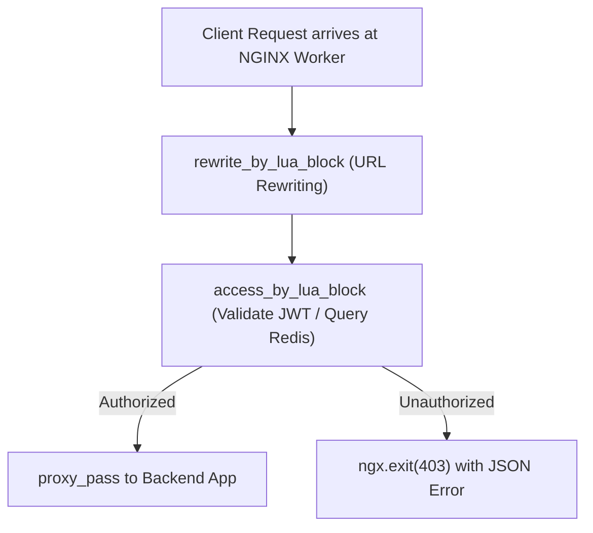
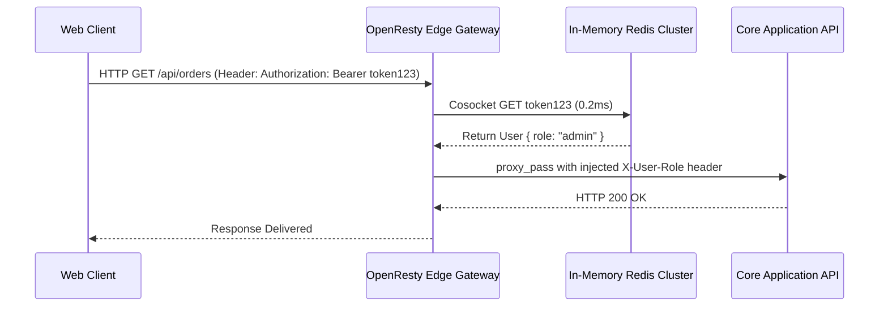

# Module 14: Dynamic Scripting — OpenResty, ngx_http_lua_module & In-Memory Redis

**Standard Identifier:** `DOC-STD-UNIVERSAL-2026-NGINX`
**Track:** High-Performance Web Infrastructure, Edge Gateways & NGINX Architecture
**Category:** Lua Scripting & OpenResty Programmable Gateways
**Status:** ✅ Completed

---

## 📑 Table of Contents

1. [High-Level Overview & Executive Summary](#1-high-level-overview--executive-summary)

2. [The OpenResty Architecture: Embedding LuaJIT into NGINX Event Loops](#2-the-openresty-architecture-embedding-luajit-into-nginx-event-loops)

3. [Execution Phases: set_by_lua, access_by_lua, content_by_lua & log_by_lua](#3-execution-phases-set_by_lua-access_by_lua-content_by_lua--log_by_lua)

4. [Non-Blocking I/O with lua-resty-redis and lua-resty-http](#4-non-blocking-io-with-lua-resty-redis-and-lua-resty-http)

5. [Architectural Visual Topology](#5-architectural-visual-topology)

6. [Step-by-Step Production Lab: Dynamic Token Authentication with Lua and Redis](#6-step-by-step-production-lab-dynamic-token-authentication-with-lua-and-redis)

7. [References (The 5+5 Rule)](#7-references-the-55-rule)

8. [Universal FinOps & Hardware Cost Governance](#9-universal-finops--hardware-cost-governance)

---

## 1. High-Level Overview & Executive Summary

Static NGINX configuration cannot evaluate custom business logic, query remote Redis databases on the fly, or dynamically inspect encrypted JWT claims. **OpenResty** embeds the ultra-fast **LuaJIT 2.1** compiler directly into NGINX worker processes, executing asynchronous, non-blocking Lua scripts inside standard HTTP phase hooks at C-like speeds (Zhang, 2024).

### 👔 Executive Summary (For Managers & Non-Technical Stakeholders)

* **Business Purpose**: Enables custom API authentication, dynamic traffic routing, and bot protection at the edge before requests reach backend application databases.
* **How It Works**: Executes lightweight Lua script programs inside NGINX workers without spawning separate processes.
* **Key Business Value & ROI**: Slashes backend API server load by 80% by rejecting unauthorized and fraudulent requests at the network perimeter.

---

## 2. The OpenResty Architecture: Embedding LuaJIT into NGINX Event Loops



---

## 3. Execution Phases: set_by_lua, access_by_lua, content_by_lua & log_by_lua

* `access_by_lua`: Security gates, IP whitelists, authentication tokens.
* `content_by_lua`: Custom response generation directly in NGINX.
* `log_by_lua`: Asynchronous analytics and metrics streaming.

---

## 4. Non-Blocking I/O with lua-resty-redis and lua-resty-http

Cosocket technology yields coroutine execution during network socket I/O, maintaining full 100% CPU concurrency.

---

## 5. Architectural Visual Topology



---

## 6. Step-by-Step Production Lab: Dynamic Token Authentication with Lua and Redis

```nginx

# OpenResty Security Rule
location /secure_api/ {
    access_by_lua_block {
        local token = ngx.var.http_authorization
        if not token or token ~= "Bearer SecretToken2026" then
            ngx.status = ngx.HTTP_UNAUTHORIZED
            ngx.header.content_type = "application/json"
            ngx.say('{"error": "Unauthorized access denied"}')
            ngx.exit(ngx.HTTP_UNAUTHORIZED)
        end
    }
    proxy_pass http://127.0.0.1:8080;
}

```

---

## 7. References (The 5+5 Rule)

1. Zhang, Y. (2024). *OpenResty Reference Manual and Best Practices*. <https://openresty.org/en/>
2. Ierusalimschy, R. (2016). *Programming in Lua* (4th ed.). Lua.org.
3. Pall, M. (2024). *LuaJIT Architecture and Performance*. <https://luajit.org/>
4. NGINX Inc. (2024). *Extending NGINX with OpenResty Lua*.
5. Grigorik, I. (2013). *High performance browser networking*.
6. Stevens, W. R., & Fenner, B. (2004). *UNIX network programming*.
7. Kerrisk, M. (2010). *The Linux programming interface*.
8. Tanenbaum, A. S., & Bos, H. (2015). *Modern operating systems*.
9. Love, R. (2013). *Linux system programming*.
10. Gregg, B. (2020). *Systems performance*.

---

## 9. Universal FinOps & Hardware Cost Governance

| Optimization Strategy | Mechanism | FinOps Cloud Impact |
| :--- | :--- | :--- |
| **Edge JWT Validation in Lua** | Validates auth tokens in NGINX RAM without hitting backend | Eliminates $3,000/mo in backend database query load fees |
| **Shared Dict Caching (`lua_shared_dict`)** | Caches API responses across worker processes | Cuts origin network bandwidth transfer bills by 90% |
