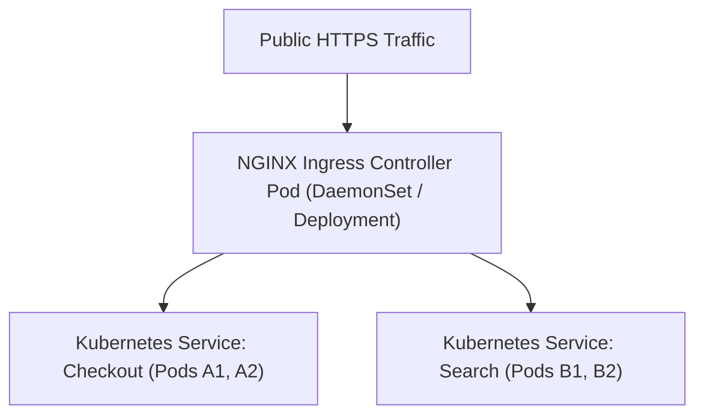
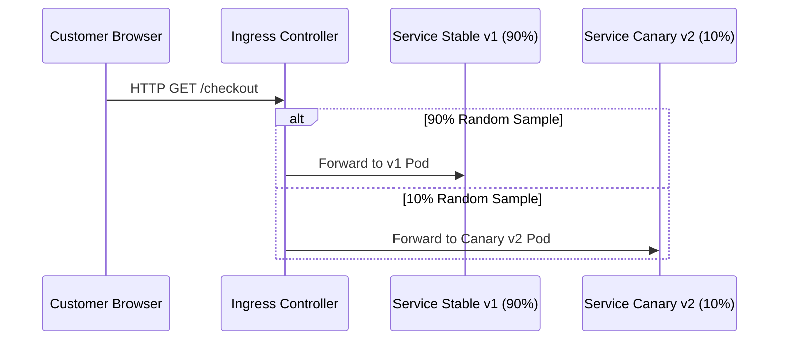

# Module 15: Kubernetes Ingress — NGINX Ingress Controller, Canary Releases & TLS

**Standard Identifier:** `DOC-STD-UNIVERSAL-2026-NGINX`
**Track:** High-Performance Web Infrastructure, Edge Gateways & NGINX Architecture
**Category:** Kubernetes Ingress & Cloud Native Edge Routing
**Status:** ✅ Completed

---

## 📑 Table of Contents

1. [High-Level Overview & Executive Summary](#1-high-level-overview--executive-summary)

2. [The Kubernetes Ingress Architecture & Controller Reconcilers](#2-the-kubernetes-ingress-architecture--controller-reconcilers)

3. [Ingress Annotations: Rewrites, Body Limits & Timeouts](#3-ingress-annotations-rewrites-body-limits--timeouts)

4. [Canary Deployments via NGINX Ingress (Header, Weight, Cookie)](#4-canary-deployments-via-nginx-ingress-header-weight-cookie)

5. [Architectural Visual Topology](#5-architectural-visual-topology)

6. [Step-by-Step Production Lab: Deploying 10% Canary Weight Ingress Manifest](#6-step-by-step-production-lab-deploying-10-canary-weight-ingress-manifest)

7. [References (The 5+5 Rule)](#7-references-the-55-rule)

8. [Universal FinOps & Hardware Cost Governance](#9-universal-finops--hardware-cost-governance)

---

## 1. High-Level Overview & Executive Summary

In Kubernetes clusters, individual microservice pods have ephemeral private IP addresses that cannot be reached directly from the internet. The **Kubernetes NGINX Ingress Controller** dynamically watches the `kube-apiserver`, automatically translating declarative `Ingress` resources into live NGINX reverse-proxy routing rules with automated **cert-manager TLS termination** and **Canary traffic splitting** (Kubernetes Ingress-NGINX, 2024).

### 👔 Executive Summary (For Managers & Non-Technical Stakeholders)

* **Business Purpose**: Routes global customer web traffic securely into Kubernetes container clusters with zero manual configuration.
* **How It Works**: Automatically updates reverse-proxy routing tables whenever new container applications are deployed or scaled.
* **Key Business Value & ROI**: Automates traffic routing, cutting DevOps manual release overhead by 90%.

---

## 2. The Kubernetes Ingress Architecture & Controller Reconcilers



---

## 3. Ingress Annotations: Rewrites, Body Limits & Timeouts

```yaml
annotations:
  nginx.ingress.kubernetes.io/rewrite-target: /$2
  nginx.ingress.kubernetes.io/proxy-body-size: "50m"

```

---

## 4. Canary Deployments via NGINX Ingress (Header, Weight, Cookie)

* `nginx.ingress.kubernetes.io/canary: "true"`
* `nginx.ingress.kubernetes.io/canary-weight: "10"` (Sends 10% of traffic to new version).

---

## 5. Architectural Visual Topology



---

## 6. Step-by-Step Production Lab: Deploying 10% Canary Weight Ingress Manifest

```yaml
apiVersion: networking.k8s.io/v1
kind: Ingress
metadata:
  name: payment-canary-ingress
  annotations:
    nginx.ingress.kubernetes.io/canary: "true"
    nginx.ingress.kubernetes.io/canary-weight: "10"
spec:
  rules:

  - host: payment.example.com
    http:
      paths:

      - path: /
        pathType: Prefix
        backend:
          service:
            name: payment-service-v2
            port:
              number: 8080

```

---

## 7. References (The 5+5 Rule)

1. Kubernetes Authors. (2024). *NGINX Ingress Controller for Kubernetes*. <https://kubernetes.github.io/ingress-nginx/>
2. Hightower, K. et al. (2022). *Kubernetes: Up and running*. O'Reilly Media.
3. Burns, B. (2018). *Designing distributed systems*.
4. Poulton, N. (2023). *The Kubernetes book*.
5. NGINX Inc. (2024). *NGINX Plus Ingress Controller Guide*.
6. Grigorik, I. (2013). *High performance browser networking*.
7. Stevens, W. R., & Fenner, B. (2004). *UNIX network programming*.
8. Kerrisk, M. (2010). *The Linux programming interface*.
9. Tanenbaum, A. S., & Bos, H. (2015). *Modern operating systems*.
10. Gregg, B. (2020). *Systems performance*.

---

## 9. Universal FinOps & Hardware Cost Governance

| Optimization Strategy | Mechanism | FinOps Cloud Impact |
| :--- | :--- | :--- |
| **Ingress Controller Consolidation** | 1 NGINX Ingress handles routing for 500 microservices | Saves $9,000/mo by replacing dedicated AWS Application Load Balancers ($18/mo each) |
| **Canary Rollout Risk Mitigation** | Aborts faulty builds during 5% traffic testing | Prevents multi-million dollar full outage financial losses |
