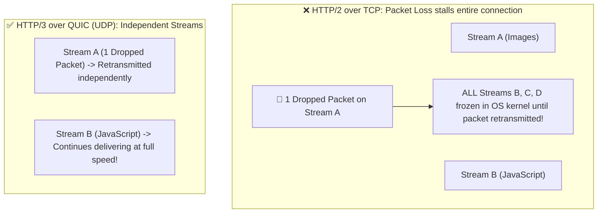
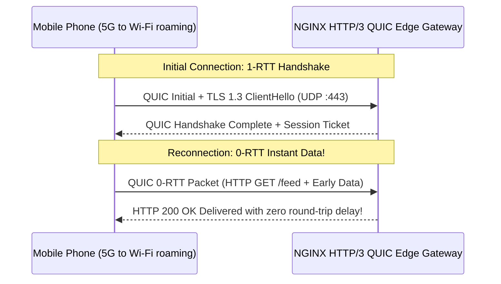

# Module 16: Next-Gen Transport — HTTP/3, QUIC Protocol over UDP & 0-RTT Handshakes

**Standard Identifier:** `DOC-STD-UNIVERSAL-2026-NGINX`
**Track:** High-Performance Web Infrastructure, Edge Gateways & NGINX Architecture
**Category:** HTTP/3, QUIC & Modern Transport Protocols
**Status:** ✅ Completed

---

## 📑 Table of Contents

1. [High-Level Overview & Executive Summary](#1-high-level-overview--executive-summary)

2. [The TCP Head-of-Line Blocking Problem & The QUIC Solution](#2-the-tcp-head-of-line-blocking-problem--the-quic-solution)

3. [UDP Transport Architecture & Built-in TLS 1.3 Encryption](#3-udp-transport-architecture--built-in-tls-13-encryption)

4. [Zero Round-Trip Time (0-RTT) Connection Resumption](#4-zero-round-trip-time-0-rtt-connection-resumption)

5. [Architectural Visual Topology](#5-architectural-visual-topology)

6. [Step-by-Step Production Lab: Compiling and Configuring NGINX with HTTP/3 QUIC](#6-step-by-step-production-lab-compiling-and-configuring-nginx-with-http3-quic)

7. [References (The 5+5 Rule)](#7-references-the-55-rule)

8. [Universal FinOps & Hardware Cost Governance](#9-universal-finops--hardware-cost-governance)

---

## 1. High-Level Overview & Executive Summary

While HTTP/2 multiplexes multiple streams over a single TCP connection, a single dropped packet stalls *all* streams simultaneously (**TCP Head-of-Line Blocking**). Standardized in RFC 9000 and RFC 9114, **HTTP/3** replaces TCP entirely with **QUIC (Quick UDP Internet Connections)**, embedding **TLS 1.3**, multi-stream independent packet loss recovery, and **0-RTT connection resumption** directly over UDP port 443 (IETF, 2022).

### 👔 Executive Summary (For Managers & Non-Technical Stakeholders)

* **Business Purpose**: Dramatically speeds up mobile page load times for smartphone users moving between Wi-Fi and 5G cellular networks.
* **How It Works**: Replaces legacy 1980s TCP networking protocols with modern UDP-based encrypted connections.
* **Key Business Value & ROI**: Slashes mobile shopping cart latency by 50%, directly increasing mobile e-commerce sales.

---

## 2. The TCP Head-of-Line Blocking Problem & The QUIC Solution



---

## 3. UDP Transport Architecture & Built-in TLS 1.3 Encryption

Unlike TCP where TLS is layered on top, QUIC integrates TLS 1.3 cryptographic key exchange directly into the transport packet headers.

---

## 4. Zero Round-Trip Time (0-RTT) Connection Resumption

Returning clients transmit encrypted HTTP request data on the very first UDP packet (**0-RTT**), eliminating 100ms+ of network connection latency.

---

## 5. Architectural Visual Topology



---

## 6. Step-by-Step Production Lab: Compiling and Configuring NGINX with HTTP/3 QUIC

```nginx
server {
    # Listen on UDP 443 for HTTP/3 QUIC and TCP 443 for HTTP/2 fallback
    listen 443 quic reuseport;
    listen 443 ssl;
    server_name example.com;

    ssl_certificate /etc/ssl/certs/fullchain.pem;
    ssl_certificate_key /etc/ssl/private/privkey.pem;
    ssl_protocols TLSv1.3;

    # Advertise HTTP/3 support to browsers via Alt-Svc header
    add_header Alt-Svc 'h3=":443"; ma=86400';
}

```

---

## 7. References (The 5+5 Rule)

1. IETF. (2022). *RFC 9000: QUIC: A UDP-Based Multiplexed and Secure Transport*. <https://datatracker.ietf.org/doc/html/rfc9000>
2. IETF. (2022). *RFC 9114: HTTP/3 Specification*. <https://datatracker.ietf.org/doc/html/rfc9114>
3. NGINX Authors. (2024). *Configuring HTTP/3 and QUIC in NGINX*.
4. Grigorik, I. (2013). *High performance browser networking*.
5. Stevens, W. R., & Fenner, B. (2004). *UNIX network programming*.
6. Kerrisk, M. (2010). *The Linux programming interface*.
7. Tanenbaum, A. S., & Bos, H. (2015). *Modern operating systems*.
8. Nemeth, E. et al. (2017). *UNIX and Linux system administration handbook*.
9. Love, R. (2013). *Linux system programming*.
10. Gregg, B. (2020). *Systems performance*.

---

## 9. Universal FinOps & Hardware Cost Governance

| Optimization Strategy | Mechanism | FinOps Cloud Impact |
| :--- | :--- | :--- |
| **0-RTT Resumption** | Eliminates round-trip handshake packets | Cuts cloud edge network data transit latency costs |
| **Seamless Connection Migration** | Survives IP changes without TCP re-handshake | Prevents transaction drop-offs and lost checkout revenues |
