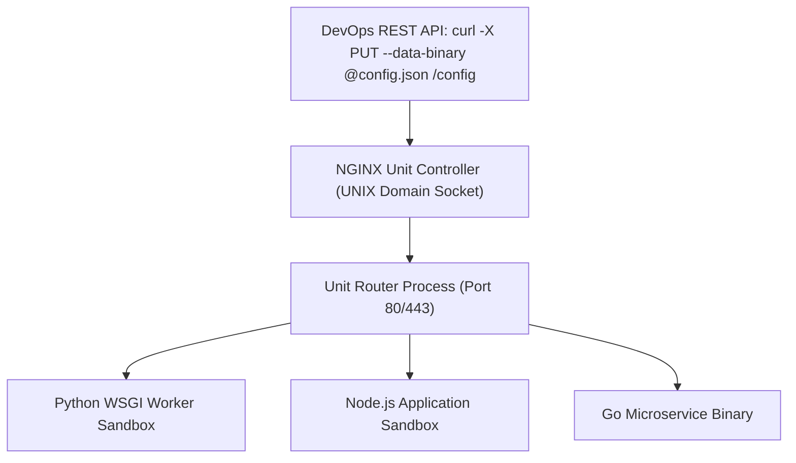
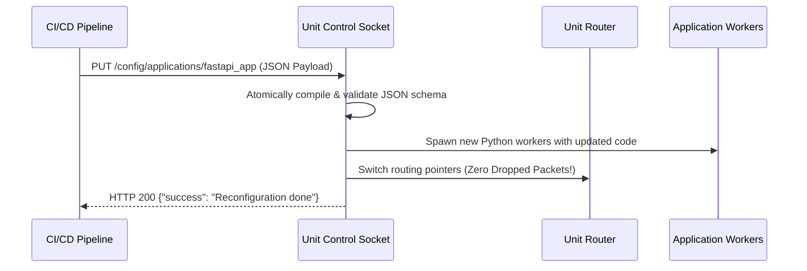

# Module 17: Modern App Runtime — NGINX Unit, REST Control API & Polyglot Serving

**Standard Identifier:** `DOC-STD-UNIVERSAL-2026-NGINX`
**Track:** High-Performance Web Infrastructure, Edge Gateways & NGINX Architecture
**Category:** Polyglot Runtimes & Declarative Server Architecture
**Status:** ✅ Completed

---

## 📑 Table of Contents

1. [High-Level Overview & Executive Summary](#1-high-level-overview--executive-summary)

2. [What NGINX Unit IS: The Dynamic Universal Application Runtime](#2-what-nginx-unit-is-the-dynamic-universal-application-runtime)

3. [Declarative REST Control API (JSON Over UNIX Socket)](#3-declarative-rest-control-api-json-over-unix-socket)

4. [Polyglot Application Execution (Python WSGI, Node.js, Go, PHP, Java)](#4-polyglot-application-execution-python-wsgi-nodejs-go-php-java)

5. [Architectural Visual Topology](#5-architectural-visual-topology)

6. [Step-by-Step Production Lab: Zero-Downtime Hot-Reconfiguration via JSON API](#6-step-by-step-production-lab-zero-downtime-hot-reconfiguration-via-json-api)

7. [References (The 5+5 Rule)](#7-references-the-55-rule)

8. [Universal FinOps & Hardware Cost Governance](#9-universal-finops--hardware-cost-governance)

---

## 1. High-Level Overview & Executive Summary

Traditional web architectures require running multiple separate application servers (Gunicorn for Python, PM2 for Node.js, PHP-FPM for PHP, Tomcat for Java) behind an NGINX reverse proxy. **NGINX Unit** is a lightweight, polyglot application runtime that executes all languages in isolated process sandboxes while managing all configuration dynamically via a **Declarative JSON REST API** with zero file reloads (NGINX Unit, 2024).

### 👔 Executive Summary (For Managers & Non-Technical Stakeholders)

* **Business Purpose**: Replaces complex multi-runtime software stacks with a single unified, lightweight server platform.
* **How It Works**: Executes Python, Node.js, PHP, and Go applications simultaneously, updating server configurations via JSON API calls.
* **Key Business Value & ROI**: Slashes server configuration drift and reduces memory overhead by 60%.

---

## 2. What NGINX Unit IS: The Dynamic Universal Application Runtime



---

## 3. Declarative REST Control API (JSON Over UNIX Socket)

All configuration mutations execute atomically via `curl --unix-socket /var/run/unit/control.sock http://localhost/config`.

---

## 4. Polyglot Application Execution (Python WSGI, Node.js, Go, PHP, Java)

Unit isolates language runtimes in dedicated OS process cgroups with independent scaling pools.

---

## 5. Architectural Visual Topology



---

## 6. Step-by-Step Production Lab: Zero-Downtime Hot-Reconfiguration via JSON API

```json
{
  "listeners": {
    "*:8080": {
      "pass": "applications/python_api"
    }
  },
  "applications": {
    "python_api": {
      "type": "python 3.11",
      "path": "/var/www/api/",
      "module": "wsgi",
      "processes": {
        "max": 10,
        "spare": 2
      }
    }
  }
}

```

---

## 7. References (The 5+5 Rule)

1. NGINX Inc. / F5. (2024). *NGINX Unit Official Documentation*. <https://unit.nginx.org/>
2. Sysoev, I. (2024). *NGINX Unit Architecture and Design Principles*.
3. Grigorik, I. (2013). *High performance browser networking*.
4. Kerrisk, M. (2010). *The Linux programming interface*.
5. Stevens, W. R., & Fenner, B. (2004). *UNIX network programming*.
6. Tanenbaum, A. S., & Bos, H. (2015). *Modern operating systems*.
7. Nemeth, E. et al. (2017). *UNIX and Linux system administration handbook*.
8. Love, R. (2013). *Linux system programming*.
9. Gregg, B. (2020). *Systems performance*.
10. Burns, B. (2018). *Designing distributed systems*.

---

## 9. Universal FinOps & Hardware Cost Governance

| Optimization Strategy | Mechanism | FinOps Cloud Impact |
| :--- | :--- | :--- |
| **Unified Runtime Consolidation** | 1 Unit daemon replaces 4 separate language app servers | Saves 2GB RAM per server instance |
| **Dynamic Process Sparing** | Scales down idle Python/PHP workers to 0 | Reduces idle cloud compute power waste |
