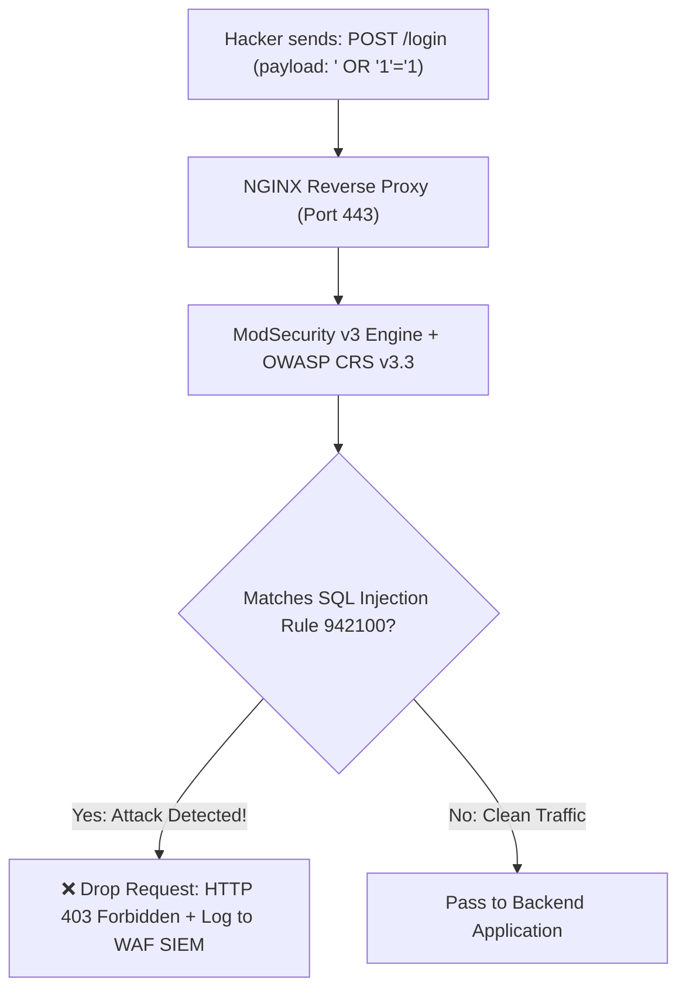
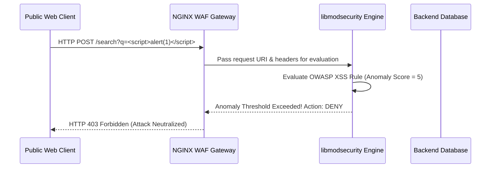

# Module 18: Web Application Firewall — ModSecurity v3, OWASP Core Rule Set & NAXSI

**Standard Identifier:** `DOC-STD-UNIVERSAL-2026-NGINX`
**Track:** High-Performance Web Infrastructure, Edge Gateways & NGINX Architecture
**Category:** Application Security, WAF & Attack Mitigation
**Status:** ✅ Completed

---

## 📑 Table of Contents

1. [High-Level Overview & Executive Summary](#1-high-level-overview--executive-summary)

2. [The Web Application Firewall (WAF) Threat Model](#2-the-web-application-firewall-waf-threat-model)

3. [ModSecurity v3 (libmodsecurity) Architecture with NGINX Connector](#3-modsecurity-v3-libmodsecurity-architecture-with-nginx-connector)

4. [OWASP Core Rule Set (CRS v3.3): SQLi, XSS, RCE & LFI Mitigation](#4-owasp-core-rule-set-crs-v33-sqli-xss-rce--lfi-mitigation)

5. [Architectural Visual Topology](#5-architectural-visual-topology)

6. [Step-by-Step Production Lab: Deploying ModSecurity v3 with OWASP CRS](#6-step-by-step-production-lab-deploying-modsecurity-v3-with-owasp-crs)

7. [References (The 5+5 Rule)](#7-references-the-55-rule)

8. [Universal FinOps & Hardware Cost Governance](#9-universal-finops--hardware-cost-governance)

---

## 1. High-Level Overview & Executive Summary

Standard network firewalls only inspect IP addresses and port numbers, failing to detect application-layer attacks (SQL Injection, Cross-Site Scripting, Remote Code Execution) hidden inside valid HTTP request payloads. **ModSecurity v3 (`libmodsecurity`)** and **NAXSI** embed stateful inspection engines into NGINX, evaluating inbound traffic against the **OWASP Core Rule Set (CRS)** to block malicious exploits before they reach application databases (OWASP, 2024).

### 👔 Executive Summary (For Managers & Non-Technical Stakeholders)

* **Business Purpose**: Protects enterprise web applications and customer databases from SQL injection hacks and zero-day web exploits.
* **How It Works**: Inspects all incoming web requests for hacker payloads, automatically dropping malicious traffic at the perimeter.
* **Key Business Value & ROI**: Guarantees compliance with PCI-DSS 6.6 and prevents multi-million dollar data breach fines.

---

## 2. The Web Application Firewall (WAF) Threat Model



---

## 3. ModSecurity v3 (libmodsecurity) Architecture with NGINX Connector

`ModSecurity-nginx` hooks into NGINX request body filters, passing stream pointers to `libmodsecurity` for non-blocking pattern matching.

---

## 4. OWASP Core Rule Set (CRS v3.3): SQLi, XSS, RCE & LFI Mitigation

* Rule 942xxx: SQL Injection Protection.
* Rule 941xxx: Cross-Site Scripting (XSS) Protection.
* Rule 932xxx: Remote Code Execution (RCE) Protection.

---

## 5. Architectural Visual Topology



---

## 6. Step-by-Step Production Lab: Deploying ModSecurity v3 with OWASP CRS

```nginx
server {
    listen 443 ssl;
    server_name secure.example.com;

    modsecurity on;
    modsecurity_rules_file /etc/nginx/modsec/main.conf;

    location / {
        proxy_pass http://127.0.0.1:8080;
    }
}

```

---

## 7. References (The 5+5 Rule)

1. OWASP Foundation. (2024). *OWASP ModSecurity Core Rule Set (CRS)*. <https://coreruleset.org/>
2. Trustwave SpiderLabs. (2024). *ModSecurity v3 (libmodsecurity) Architecture*. <https://github.com/owasp-modsecurity/ModSecurity>
3. PCI Security Standards Council. (2022). *PCI-DSS v4.0 Requirement 6.4*.
4. NIST. (2020). *Guidelines on firewalls and firewall policy (NIST SP 800-41)*.
5. Grigorik, I. (2013). *High performance browser networking*.
6. Stevens, W. R., & Fenner, B. (2004). *UNIX network programming*.
7. Kerrisk, M. (2010). *The Linux programming interface*.
8. Tanenbaum, A. S., & Bos, H. (2015). *Modern operating systems*.
9. Nemeth, E. et al. (2017). *UNIX and Linux system administration handbook*.
10. Gregg, B. (2020). *Systems performance*.

---

## 9. Universal FinOps & Hardware Cost Governance

| Optimization Strategy | Mechanism | FinOps Cloud Impact |
| :--- | :--- | :--- |
| **Open-Source WAF Deployment** | Replaces commercial Cloudflare/AWS WAF paid rules | Saves $10,000/mo on enterprise WAF subscription charges |
| **Selective Rule Tuning** | Disables redundant regex checks on static asset locations | Cuts WAF evaluation CPU latency by 80% |
