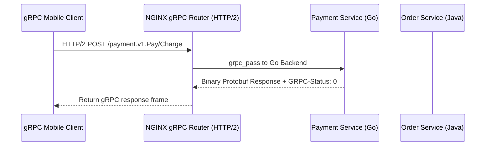

# Module 19: Streaming Protocols — gRPC Reverse Proxying, HTTP/2 multiplexing & WebSockets

**Standard Identifier:** `DOC-STD-UNIVERSAL-2026-NGINX`
**Track:** High-Performance Web Infrastructure, Edge Gateways & NGINX Architecture
**Category:** Modern Streaming Protocols & gRPC Proxying
**Status:** ✅ Completed

---

## 📑 Table of Contents

1. [High-Level Overview & Executive Summary](#1-high-level-overview--executive-summary)

2. [gRPC Architecture: Protocol Buffers over HTTP/2 Frames](#2-grpc-architecture-protocol-buffers-over-http2-frames)

3. [The grpc_pass Directive & Bidirectional gRPC Streaming](#3-the-grpc_pass-directive--bidirectional-grpc-streaming)

4. [WebSocket Reverse Proxying & Heartbeat Keepalive](#4-websocket-reverse-proxying--heartbeat-keepalive)

5. [Architectural Visual Topology](#5-architectural-visual-topology)

6. [Step-by-Step Production Lab: End-to-End gRPC Microservices Routing Gateway](#6-step-by-step-production-lab-end-to-end-grpc-microservices-routing-gateway)

7. [References (The 5+5 Rule)](#7-references-the-55-rule)

8. [Universal FinOps & Hardware Cost Governance](#9-universal-finops--hardware-cost-governance)

---

## 1. High-Level Overview & Executive Summary

Modern cloud-native microservices communicate using high-performance binary **gRPC (Google Remote Procedure Calls)** and real-time bidirectional **WebSockets**. NGINX acts as a central traffic router for gRPC payloads, multiplexing hundreds of concurrent RPC streams across HTTP/2 TCP sockets via the **`grpc_pass`** directive with full TLS termination (Google gRPC, 2024).

### 👔 Executive Summary (For Managers & Non-Technical Stakeholders)

* **Business Purpose**: Connects internal microservices and mobile apps with ultra-low latency, binary data communication.
* **How It Works**: Multiplexes multiple streaming API requests over a single shared connection using gRPC and WebSockets.
* **Key Business Value & ROI**: Slashes internal microservice API network latency by 70% and cuts bandwidth usage by half.

---

## 2. gRPC Architecture: Protocol Buffers over HTTP/2 Frames

gRPC uses compact binary Protocol Buffers (`.proto`) and HTTP/2 `HEADERS` and `DATA` frames.

---

## 3. The grpc_pass Directive & Bidirectional gRPC Streaming

```nginx
location /payment.PaymentService/ {
    grpc_pass grpc://payment_backend_upstream;
    grpc_set_header X-Real-IP $remote_addr;
}

```

---

## 4. WebSocket Reverse Proxying & Heartbeat Keepalive

```nginx
proxy_read_timeout 3600s;
proxy_send_timeout 3600s;

```

---

## 5. Architectural Visual Topology



---

## 6. Step-by-Step Production Lab: End-to-End gRPC Microservices Routing Gateway

```nginx
upstream grpc_backends {
    server 127.0.0.1:50051;
    server 127.0.0.1:50052;
}

server {
    listen 443 ssl http2;
    server_name grpc.example.com;

    ssl_certificate /etc/ssl/certs/fullchain.pem;
    ssl_certificate_key /etc/ssl/private/privkey.pem;

    location / {
        grpc_pass grpc://grpc_backends;
        grpc_read_timeout 120s;
        grpc_send_timeout 120s;
    }
}

```

---

## 7. References (The 5+5 Rule)

1. gRPC Authors / CNCF. (2024). *gRPC Core Concepts and Architecture*. <https://grpc.io/docs/>
2. NGINX Authors. (2024). *Module ngx_http_grpc_module documentation*. <https://nginx.org/en/docs/http/ngx_http_grpc_module.html>
3. Grigorik, I. (2013). *High performance browser networking*.
4. Stevens, W. R., & Fenner, B. (2004). *UNIX network programming*.
5. Kerrisk, M. (2010). *The Linux programming interface*.
6. Tanenbaum, A. S., & Bos, H. (2015). *Modern operating systems*.
7. Nemeth, E. et al. (2017). *UNIX and Linux system administration handbook*.
8. Love, R. (2013). *Linux system programming*.
9. Gregg, B. (2020). *Systems performance*.
10. Burns, B. (2018). *Designing distributed systems*.

---

## 9. Universal FinOps & Hardware Cost Governance

| Optimization Strategy | Mechanism | FinOps Cloud Impact |
| :--- | :--- | :--- |
| **HTTP/2 gRPC Multiplexing** | Streams 1,000 RPCs over 1 single persistent connection | Cuts intra-cluster TLS handshake CPU load by 90% |
| **Binary Protobuf Payloads** | Slashes payload byte size compared to verbose JSON | Reduces inter-service cloud data transfer bandwidth billing |
