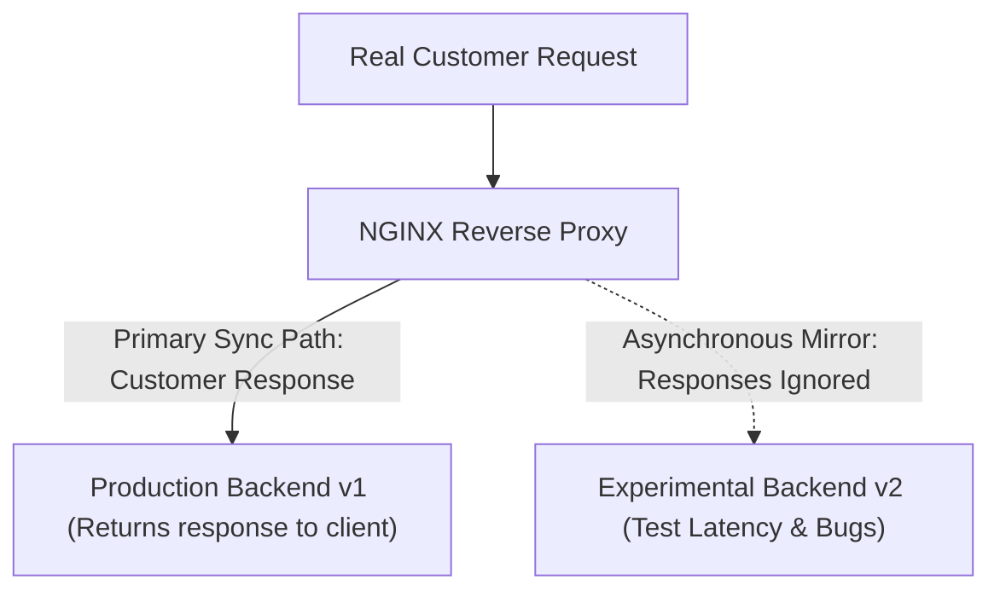
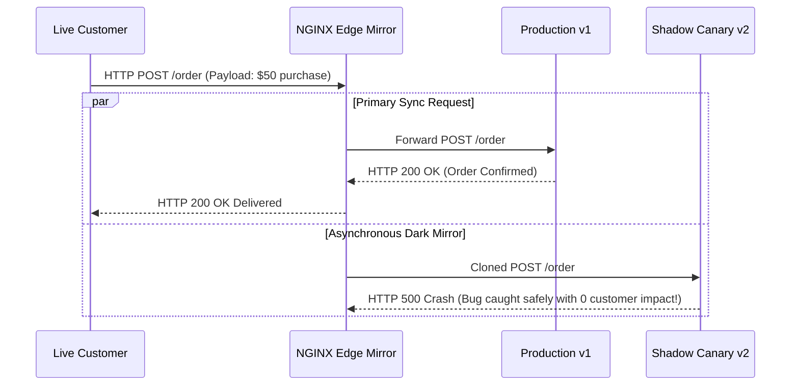

# Module 20: Traffic Shadowing — Request Mirroring, Dark Launches & Canary Validation

**Standard Identifier:** `DOC-STD-UNIVERSAL-2026-NGINX`
**Track:** High-Performance Web Infrastructure, Edge Gateways & NGINX Architecture
**Category:** Traffic Shadowing & Dark Launch Engineering
**Status:** ✅ Completed

---

## 📑 Table of Contents

1. [High-Level Overview & Executive Summary](#1-high-level-overview--executive-summary)

2. [The Production Testing Problem: Synthetic Tests vs Real Traffic](#2-the-production-testing-problem-synthetic-tests-vs-real-traffic)

3. [The mirror Directive & Asynchronous Shadow Copying](#3-the-mirror-directive--asynchronous-shadow-copying)

4. [Request Body Mirroring (mirror_request_body on)](#4-request-body-mirroring-mirror_request_body-on)

5. [Architectural Visual Topology](#5-architectural-visual-topology)

6. [Step-by-Step Production Lab: Configuring Zero-Risk Dark Traffic Mirroring](#6-step-by-step-production-lab-configuring-zero-risk-dark-traffic-mirroring)

7. [References (The 5+5 Rule)](#7-references-the-55-rule)

8. [Universal FinOps & Hardware Cost Governance](#9-universal-finops--hardware-cost-governance)

---

## 1. High-Level Overview & Executive Summary

Testing new major software releases with synthetic load tests often misses subtle production edge cases and real-world user payload bugs. **Traffic Mirroring (Shadowing)** clones live incoming production HTTP requests asynchronously using the NGINX **`mirror`** directive, sending duplicated traffic to experimental canary backends while completely ignoring the canary's responses so customer traffic is never impacted (NGINX Mirror, 2024).

### 👔 Executive Summary (For Managers & Non-Technical Stakeholders)

* **Business Purpose**: Allows engineering teams to test new software versions against 100% real live customer traffic with zero risk of breaking customer orders.
* **How It Works**: Silently duplicates incoming HTTP traffic in the background, testing new backends without returning errors to customers.
* **Key Business Value & ROI**: Eliminates high-risk production deployments and software regression bugs.

---

## 2. The Production Testing Problem: Synthetic Tests vs Real Traffic



---

## 3. The mirror Directive & Asynchronous Shadow Copying

* `mirror /mirror_endpoint;`
* Responses from the mirrored location are completely discarded by NGINX.

---

## 4. Request Body Mirroring (mirror_request_body on)

Ensures client `POST`/`PUT` JSON payloads are fully duplicated and forwarded to the shadow cluster.

---

## 5. Architectural Visual Topology



---

## 6. Step-by-Step Production Lab: Configuring Zero-Risk Dark Traffic Mirroring

```nginx
server {
    listen 80;
    server_name api.example.com;

    location /api/ {
        mirror /mirror;
        mirror_request_body on;
        proxy_pass http://production_backend;
    }

    location = /mirror {
        internal;
        proxy_pass http://shadow_canary_backend$request_uri;
        proxy_pass_request_body on;
    }
}

```

---

## 7. References (The 5+5 Rule)

1. NGINX Authors. (2024). *Module ngx_http_mirror_module documentation*. <https://nginx.org/en/docs/http/ngx_http_mirror_module.html>
2. Burns, B. (2018). *Designing distributed systems: Patterns for microservices*. O'Reilly Media.
3. Grigorik, I. (2013). *High performance browser networking*.
4. Stevens, W. R., & Fenner, B. (2004). *UNIX network programming*.
5. Kerrisk, M. (2010). *The Linux programming interface*.
6. Tanenbaum, A. S., & Bos, H. (2015). *Modern operating systems*.
7. Nemeth, E. et al. (2017). *UNIX and Linux system administration handbook*.
8. Love, R. (2013). *Linux system programming*.
9. Gregg, B. (2020). *Systems performance*.
10. Hightower, K. et al. (2022). *Kubernetes: Up and running*.

---

## 9. Universal FinOps & Hardware Cost Governance

| Optimization Strategy | Mechanism | FinOps Cloud Impact |
| :--- | :--- | :--- |
| **Dark Launch Validation** | Identifies scaling bugs before marketing launches | Prevents catastrophic Black Friday outage revenue losses |
| **Asynchronous Non-Blocking Copy** | Clones requests in memory without waiting for shadow response | Adds zero latency to customer-facing transaction paths |
