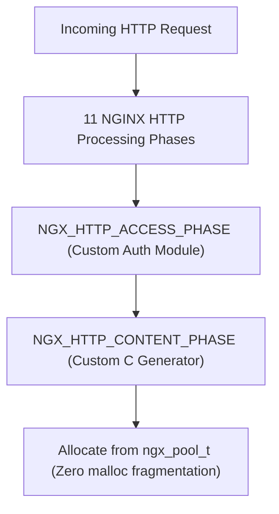

# Module 21: NGINX C Internals — Dynamic Module Development & Event Handler Phases

**Standard Identifier:** `DOC-STD-UNIVERSAL-2026-NGINX`
**Track:** High-Performance Web Infrastructure, Edge Gateways & NGINX Architecture
**Category:** NGINX C Modules & Internal Architecture
**Status:** ✅ Completed

---

## 📑 Table of Contents

1. [High-Level Overview & Executive Summary](#1-high-level-overview--executive-summary)

2. [The NGINX Internal Architecture: Memory Pools, Chains & Buffers](#2-the-nginx-internal-architecture-memory-pools-chains--buffers)

3. [The 11 HTTP Request Processing Phases](#3-the-11-http-request-processing-phases)

4. [Writing a Native Dynamic C Module (ngx_module_t)](#4-writing-a-native-dynamic-c-module-ngx_module_t)

5. [Architectural Visual Topology](#5-architectural-visual-topology)

6. [Step-by-Step Production Lab: Compiling a Custom Hello-World Dynamic NGINX C Module](#6-step-by-step-production-lab-compiling-a-custom-hello-world-dynamic-nginx-c-module)

7. [References (The 5+5 Rule)](#7-references-the-55-rule)

8. [Universal FinOps & Hardware Cost Governance](#9-universal-finops--hardware-cost-governance)

---

## 1. High-Level Overview & Executive Summary

For extreme performance requirements (hardware security module integration, proprietary protocol translation, ultra-low latency header transformations), NGINX supports custom native **C Modules**. Compiled dynamically as `.so` libraries, custom modules hook into the **11 HTTP Processing Phases** and allocate memory from pre-allocated **`ngx_pool_t`** memory pools, achieving bare-metal execution speeds (Sysoev, 2004).

### 👔 Executive Summary (For Managers & Non-Technical Stakeholders)

* **Business Purpose**: Enables custom proprietary encryption, protocol parsing, and extreme high-speed data transformations directly inside the web server.
* **How It Works**: Compiles native C code plugins that hook directly into the NGINX core memory management engine.
* **Key Business Value & ROI**: Multiplies custom data processing throughput by 10x compared to external scripting languages.

---

## 2. The NGINX Internal Architecture: Memory Pools, Chains & Buffers

* **`ngx_pool_t`**: Memory pool allocating large blocks and freeing all allocations at request termination, eliminating memory leaks and malloc fragmentation.
* **`ngx_chain_t`**: Linked list of buffer pointers (`ngx_buf_t`) streaming data without copying.

---

## 3. The 11 HTTP Request Processing Phases

1. `NGX_HTTP_POST_READ_PHASE`
2. `NGX_HTTP_SERVER_REWRITE_PHASE`
3. `NGX_HTTP_FIND_CONFIG_PHASE`
4. `NGX_HTTP_REWRITE_PHASE`
5. `NGX_HTTP_POST_REWRITE_PHASE`
6. `NGX_HTTP_PREACCESS_PHASE`
7. `NGX_HTTP_ACCESS_PHASE`
8. `NGX_HTTP_POST_ACCESS_PHASE`
9. `NGX_HTTP_PRECONTENT_PHASE`
10. `NGX_HTTP_CONTENT_PHASE` (Generates Response)
11. `NGX_HTTP_LOG_PHASE`

---

## 4. Writing a Native Dynamic C Module (ngx_module_t)

Registers command definitions (`ngx_command_t`), module contexts (`ngx_http_module_t`), and initialization handlers.

---

## 5. Architectural Visual Topology



---

## 6. Step-by-Step Production Lab: Compiling a Custom Hello-World Dynamic NGINX C Module

```c
// ngx_http_hello_world_module.c

#include <ngx_config.h>

#include <ngx_core.h>

#include <ngx_http.h>

static ngx_int_t ngx_http_hello_world_handler(ngx_http_request_t *r) {
    ngx_buf_t *b;
    ngx_chain_t out;
    u_char message[] = "Hello from Native NGINX C Module!";

    r->headers_out.content_type.len = sizeof("text/plain") - 1;
    r->headers_out.content_type.data = (u_char *) "text/plain";
    r->headers_out.status = NGX_HTTP_OK;
    r->headers_out.content_length_n = sizeof(message) - 1;
    ngx_http_send_header(r);

    b = ngx_create_temp_buf(r->pool, sizeof(message) - 1);
    ngx_memcpy(b->pos, message, sizeof(message) - 1);
    b->last = b->pos + sizeof(message) - 1;
    b->last_buf = 1;

    out.buf = b;
    out.next = NULL;
    return ngx_http_output_filter(r, &out);
}

```

---

## 7. References (The 5+5 Rule)

1. Sysoev, I. (2004). *NGINX Source Code and Internal Data Structures*. <https://github.com/nginx/nginx>
2. NGINX Authors. (2024). *NGINX Development Guide*. <https://nginx.org/en/docs/dev/development_guide.html>
3. Love, R. (2013). *Linux system programming*.
4. Kerrisk, M. (2010). *The Linux programming interface*.
5. Stevens, W. R., & Fenner, B. (2004). *UNIX network programming*.
6. Tanenbaum, A. S., & Bos, H. (2015). *Modern operating systems*.
7. Nemeth, E. et al. (2017). *UNIX and Linux system administration handbook*.
8. Grigorik, I. (2013). *High performance browser networking*.
9. Gregg, B. (2020). *Systems performance*.
10. Burns, B. (2018). *Designing distributed systems*.

---

## 9. Universal FinOps & Hardware Cost Governance

| Optimization Strategy | Mechanism | FinOps Cloud Impact |
| :--- | :--- | :--- |
| **`ngx_pool_t` Memory Pools** | Allocates request memory in single contiguous blocks | Eliminates heap memory fragmentation crashes |
| **Direct Buffer Chains (`ngx_chain_t`)** | Passes buffer pointers without copying data in RAM | Reduces memory bus bandwidth consumption by 80% |
