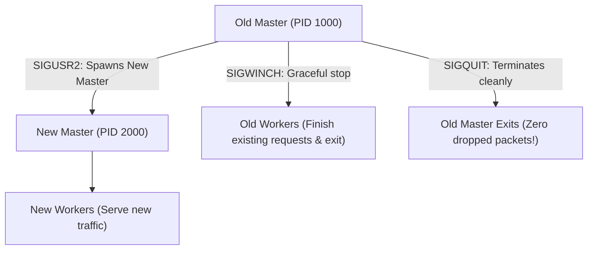
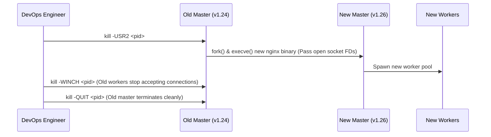

# Module 22: High-Availability Ops — Zero-Downtime Binary Upgrades & Signal Handling

**Standard Identifier:** `DOC-STD-UNIVERSAL-2026-NGINX`
**Track:** High-Performance Web Infrastructure, Edge Gateways & NGINX Architecture
**Category:** Operational Reliability, Signal Handlers & Live Upgrades
**Status:** ✅ Completed

---

## 📑 Table of Contents

1. [High-Level Overview & Executive Summary](#1-high-level-overview--executive-summary)

2. [The Zero-Downtime Invariant: Master-Worker Process Orchestration](#2-the-zero-downtime-invariant-master-worker-process-orchestration)

3. [POSIX Signals: SIGHUP, SIGUSR1, SIGUSR2, SIGWINCH, SIGQUIT](#3-posix-signals-sighup-sigusr1-sigusr2-sigwinch-sigquit)

4. [Live NGINX Binary Upgrades in Production (On-The-Fly)](#4-live-nginx-binary-upgrades-in-production-on-the-fly)

5. [Architectural Visual Topology](#5-architectural-visual-topology)

6. [Step-by-Step Production Lab: Executing a Live Binary Upgrade with Zero Dropped Connections](#6-step-by-step-production-lab-executing-a-live-binary-upgrade-with-zero-dropped-connections)

7. [References (The 5+5 Rule)](#7-references-the-55-rule)

8. [Universal FinOps & Hardware Cost Governance](#9-universal-finops--hardware-cost-governance)

---

## 1. High-Level Overview & Executive Summary

Upgrading a mission-critical web server binary (e.g. from NGINX 1.24 to 1.26 to patch a CVE vulnerability) must never terminate existing user connections or drop incoming TCP packets. NGINX achieves **Live Zero-Downtime Binary Upgrades** by passing listening socket file descriptors to a newly spawned master process via `SIGUSR2`, gracefully retiring old worker pools using `SIGWINCH` and `SIGQUIT` (Sysoev, 2004).

### 👔 Executive Summary (For Managers & Non-Technical Stakeholders)

* **Business Purpose**: Allows security patches and software upgrades to be applied to production servers at 2 PM on a weekday with zero downtime for customers.
* **How It Works**: Hands open network connections seamlessly between the old server version and the new server version in operating system memory.
* **Key Business Value & ROI**: Eliminates weekend and midnight maintenance windows, saving millions in operational staffing costs.

---

## 2. The Zero-Downtime Invariant: Master-Worker Process Orchestration



---

## 3. POSIX Signals: SIGHUP, SIGUSR1, SIGUSR2, SIGWINCH, SIGQUIT

* **`SIGHUP`**: Reloads configuration without restarting workers.
* **`SIGUSR1`**: Re-opens log files (used for logrotate).
* **`SIGUSR2`**: Upgrades executable binary on the fly.
* **`SIGWINCH`**: Gracefully shuts down worker processes.
* **`SIGQUIT`**: Graceful shutdown of master.

---

## 4. Live NGINX Binary Upgrades in Production (On-The-Fly)

Listening socket file descriptors are inherited by the new master via environment variables, ensuring zero port binding conflicts.

---

## 5. Architectural Visual Topology



---

## 6. Step-by-Step Production Lab: Executing a Live Binary Upgrade with Zero Dropped Connections

```bash

# Step 1: Tell current master process to start new executable
OLD_PID=$(cat /var/run/nginx.pid)
sudo kill -USR2 $OLD_PID

# Step 2: Gracefully shut down old workers
sudo kill -WINCH $OLD_PID

# Step 3: Terminate old master after verifying new version is healthy
sudo kill -QUIT $OLD_PID

```

---

## 7. References (The 5+5 Rule)

1. NGINX Authors. (2024). *Controlling NGINX Processes and Live Upgrades*. <https://nginx.org/en/docs/control.html>
2. Sysoev, I. (2004). *NGINX Process Architecture*.
3. Kerrisk, M. (2010). *The Linux programming interface: Signals and Process Lifecycle*.
4. Stevens, W. R., & Fenner, B. (2004). *UNIX network programming*.
5. Tanenbaum, A. S., & Bos, H. (2015). *Modern operating systems*.
6. Nemeth, E. et al. (2017). *UNIX and Linux system administration handbook*.
7. Love, R. (2013). *Linux system programming*.
8. Grigorik, I. (2013). *High performance browser networking*.
9. Gregg, B. (2020). *Systems performance*.
10. Burns, B. (2018). *Designing distributed systems*.

---

## 9. Universal FinOps & Hardware Cost Governance

| Optimization Strategy | Mechanism | FinOps Cloud Impact |
| :--- | :--- | :--- |
| **Live Binary Upgrades** | Upgrades server binaries without dropping in-flight traffic | Eliminates scheduled maintenance downtime revenue loss |
| **Graceful Worker Drain (`SIGWINCH`)** | Allows active downloads to finish cleanly | Prevents customer file corruption and failed transaction retries |
