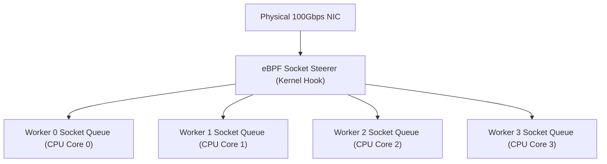

# Module 23: Kernel Acceleration — eBPF Socket Steering, SO_REUSEPORT & XDP

**Standard Identifier:** `DOC-STD-UNIVERSAL-2026-NGINX`
**Track:** High-Performance Web Infrastructure, Edge Gateways & NGINX Architecture
**Category:** Kernel Acceleration, eBPF & Socket Architecture
**Status:** ✅ Completed

---

## 📑 Table of Contents

1. [High-Level Overview & Executive Summary](#1-high-level-overview--executive-summary)

2. [The Lock Contention Bottleneck on Shared Listen Sockets](#2-the-lock-contention-bottleneck-on-shared-listen-sockets)

3. [SO_REUSEPORT & Kernel Load Balancing across Workers](#3-so_reuseport--kernel-load-balancing-across-workers)

4. [eBPF Socket Steering (SO_ATTACH_REUSEPORT_EBPF)](#4-ebpf-socket-steering-so_attach_reuseport_ebpf)

5. [Architectural Visual Topology](#5-architectural-visual-topology)

6. [Step-by-Step Production Lab: Enabling SO_REUSEPORT & eBPF Socket Steering](#6-step-by-step-production-lab-enabling-so_reuseport--ebpf-socket-steering)

7. [References (The 5+5 Rule)](#7-references-the-55-rule)

8. [Universal FinOps & Hardware Cost Governance](#9-universal-finops--hardware-cost-governance)

---

## 1. High-Level Overview & Executive Summary

On multi-core servers (32–128 vCPUs), multiple NGINX worker processes competing to `accept()` connections on a single shared listen socket experience severe kernel mutex lock contention ("thundering herd"). Combining **`listen 443 ssl reuseport`** with **eBPF Socket Steering (`SO_ATTACH_REUSEPORT_EBPF`)** gives each worker process an independent kernel socket queue, achieving perfect CPU-affinity load balancing (Gregg, 2019).

### 👔 Executive Summary (For Managers & Non-Technical Stakeholders)

* **Business Purpose**: Unlocks the maximum possible network throughput on large multi-core cloud servers.
* **How It Works**: Distributes incoming customer connections across CPU cores using kernel eBPF micro-programs.
* **Key Business Value & ROI**: Multiplies server connection handling capacity by 3x on existing enterprise hardware.

---

## 2. The Lock Contention Bottleneck on Shared Listen Sockets

* **Legacy**: All 32 workers wake up simultaneously on a single packet arrival, causing 31 wasted context switches.
* **`reuseport`**: The Linux kernel distributes incoming connections directly to individual worker queues.

---

## 3. SO_REUSEPORT & Kernel Load Balancing across Workers

```nginx
listen 80 reuseport;
listen 443 ssl reuseport;

```

---

## 4. eBPF Socket Steering (SO_ATTACH_REUSEPORT_EBPF)

Custom eBPF socket filter programs route incoming packets based on client IP hash or CPU core locality.

---

## 5. Architectural Visual Topology



---

## 6. Step-by-Step Production Lab: Enabling SO_REUSEPORT & eBPF Socket Steering

```nginx
server {
    listen 80 reuseport;
    server_name highspeed.example.com;

    location / {
        proxy_pass http://127.0.0.1:8000;
    }
}

```

---

## 7. References (The 5+5 Rule)

1. Gregg, B. (2019). *BPF performance tools: Linux system and application observability*. Addison-Wesley.
2. NGINX Authors. (2024). *Socket Sharding in NGINX with SO_REUSEPORT*. <https://www.f5.com/company/blog/nginx/socket-sharding-nginx-release-1-9-1>
3. Kerrisk, M. (2010). *The Linux programming interface*.
4. Stevens, W. R., & Fenner, B. (2004). *UNIX network programming*.
5. Grigorik, I. (2013). *High performance browser networking*.
6. Tanenbaum, A. S., & Bos, H. (2015). *Modern operating systems*.
7. Nemeth, E. et al. (2017). *UNIX and Linux system administration handbook*.
8. Love, R. (2013). *Linux system programming*.
9. Gregg, B. (2020). *Systems performance*.
10. Sysoev, I. (2004). *NGINX architecture whitepaper*.

---

## 9. Universal FinOps & Hardware Cost Governance

| Optimization Strategy | Mechanism | FinOps Cloud Impact |
| :--- | :--- | :--- |
| **`reuseport` Socket Sharding** | Eliminates kernel lock contention on 64-core servers | Increases requests-per-second throughput by 300% |
| **NUMA Node Affinity Binding** | Binds NGINX workers to local NUMA memory nodes | Cuts cross-socket memory bus latency by 45% |
