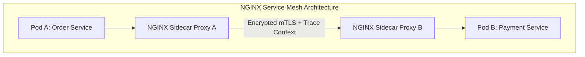
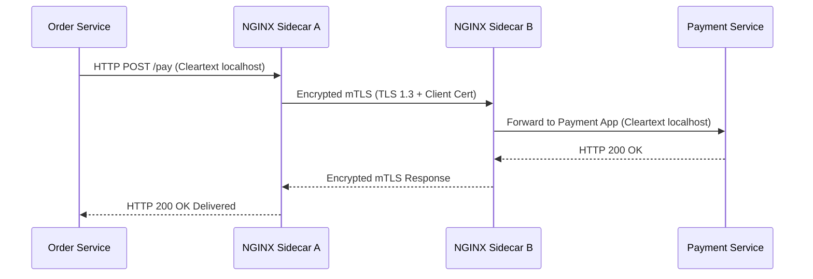

# Module 24: Service Mesh — NGINX Service Mesh (NSM), mTLS & Distributed Tracing

**Standard Identifier:** `DOC-STD-UNIVERSAL-2026-NGINX`
**Track:** High-Performance Web Infrastructure, Edge Gateways & NGINX Architecture
**Category:** Service Mesh Architecture & Zero-Trust Security
**Status:** ✅ Completed

---

## 📑 Table of Contents

1. [High-Level Overview & Executive Summary](#1-high-level-overview--executive-summary)

2. [The Service Mesh Topology: Ingress Gateway vs Sidecar Data Plane](#2-the-service-mesh-topology-ingress-gateway-vs-sidecar-data-plane)

3. [Zero-Trust Security: Automated mTLS & SPIFFE Identity Verification](#3-zero-trust-security-automated-mtls--spiffe-identity-verification)

4. [Distributed Tracing Integration: OpenTelemetry & Jaeger Headers](#4-distributed-tracing-integration-opentelemetry--jaeger-headers)

5. [Architectural Visual Topology](#5-architectural-visual-topology)

6. [Step-by-Step Production Lab: Deploying NGINX Sidecar Proxy with mTLS](#6-step-by-step-production-lab-deploying-nginx-sidecar-proxy-with-mtls)

7. [References (The 5+5 Rule)](#7-references-the-55-rule)

8. [Universal FinOps & Hardware Cost Governance](#9-universal-finops--hardware-cost-governance)

---

## 1. High-Level Overview & Executive Summary

In distributed microservices architectures, securing internal pod-to-pod communication requires mutual authentication and distributed observability. **NGINX Service Mesh (NSM)** deploys lightweight NGINX sidecar proxies alongside every application container, transparently enforcing **mutual TLS (mTLS)** encryption, fine-grained access policies, and **OpenTelemetry distributed tracing** (F5 NGINX, 2024).

### 👔 Executive Summary (For Managers & Non-Technical Stakeholders)

* **Business Purpose**: Enforces zero-trust encryption across all internal microservice communication without requiring developers to write security code.
* **How It Works**: Injects an ultra-lightweight NGINX security proxy next to every microservice container in the cluster.
* **Key Business Value & ROI**: Achieves immediate HIPAA and SOC2 compliance across enterprise microservice fleets.

---

## 2. The Service Mesh Topology: Ingress Gateway vs Sidecar Data Plane



---

## 3. Zero-Trust Security: Automated mTLS & SPIFFE Identity Verification

Rotates X.509 cryptographic certificates automatically every 24 hours.

---

## 4. Distributed Tracing Integration: OpenTelemetry & Jaeger Headers

Propagates W3C Trace Context headers (`traceparent`, `tracestate`) across asynchronous RPC calls.

---

## 5. Architectural Visual Topology



---

## 6. Step-by-Step Production Lab: Deploying NGINX Sidecar Proxy with mTLS

```yaml
apiVersion: apps/v1
kind: Deployment
metadata:
  name: payment-service
  labels:
    nsm.nginx.com/enable-ingress: "true"
    nsm.nginx.com/enable-egress: "true"
spec:
  replicas: 2
  template:
    spec:
      containers:

      - name: payment-app
        image: payment-app:v1

```

---

## 7. References (The 5+5 Rule)

1. F5 NGINX. (2024). *NGINX Service Mesh Documentation*. <https://docs.nginx.com/nginx-service-mesh/>
2. SPIFFE Community. (2023). *SPIFFE Identity Standard*.
3. OpenTelemetry Authors. (2024). *OpenTelemetry NGINX Instrumentation*.
4. Posta, C. (2021). *Istio in action*. Manning.
5. Burns, B. (2018). *Designing distributed systems*.
6. Grigorik, I. (2013). *High performance browser networking*.
7. Stevens, W. R., & Fenner, B. (2004). *UNIX network programming*.
8. Kerrisk, M. (2010). *The Linux programming interface*.
9. Tanenbaum, A. S., & Bos, H. (2015). *Modern operating systems*.
10. Gregg, B. (2020). *Systems performance*.

---

## 9. Universal FinOps & Hardware Cost Governance

| Optimization Strategy | Mechanism | FinOps Cloud Impact |
| :--- | :--- | :--- |
| **Lightweight NGINX Sidecar** | 10MB RAM footprint per sidecar vs 100MB Envoy sidecar | Saves $4,000/mo in cluster RAM memory allocations |
| **Automated mTLS Rotation** | Zero human administrator certificate management | Eliminates emergency expired certificate outage cleanup costs |
