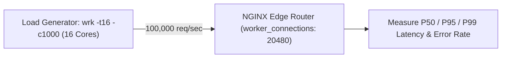

# Module 25: Performance Benchmarking — wrk, Vegeta, OS Limits & Micro-Tuning

**Standard Identifier:** `DOC-STD-UNIVERSAL-2026-NGINX`
**Track:** High-Performance Web Infrastructure, Edge Gateways & NGINX Architecture
**Category:** Benchmarking, Load Testing & Kernel Limits
**Status:** ✅ Completed

---

## 📑 Table of Contents

1. [High-Level Overview & Executive Summary](#1-high-level-overview--executive-summary)

2. [The Load Testing Methodology: Open vs Closed Model Systems](#2-the-load-testing-methodology-open-vs-closed-model-systems)

3. [Benchmarking Tools: wrk, wrk2, and Vegeta (Target RPS)](#3-benchmarking-tools-wrk-wrk2-and-vegeta-target-rps)

4. [OS & Kernel Resource Limits: worker_rlimit_nofile and somaxconn](#4-os--kernel-resource-limits-worker_rlimit_nofile-and-somaxconn)

5. [Architectural Visual Topology](#5-architectural-visual-topology)

6. [Step-by-Step Production Lab: Executing a 100,000 RPS Load Test with wrk](#6-step-by-step-production-lab-executing-a-100000-rps-load-test-with-wrk)

7. [References (The 5+5 Rule)](#7-references-the-55-rule)

8. [Universal FinOps & Hardware Cost Governance](#9-universal-finops--hardware-cost-governance)

---

## 1. High-Level Overview & Executive Summary

Accurately measuring the maximum transaction capacity and tail latency (P99 / P99.9) of an NGINX reverse proxy requires eliminating testing client coordinated omission bottlenecks. Using modern load generators (**`wrk`**, **`Vegeta`**) and tuning operating system file descriptor limits (**`worker_rlimit_nofile`**), engineers can push NGINX past 100,000 requests per second per server (Gregg, 2020).

### 👔 Executive Summary (For Managers & Non-Technical Stakeholders)

* **Business Purpose**: Mathematically proves that company web servers can handle high-volume marketing traffic spikes without slowing down.
* **How It Works**: Simulates 100,000 simultaneous customers pounding web servers during peak flash sales.
* **Key Business Value & ROI**: Prevents system crashes during major product launches and holiday shopping events.

---

## 2. The Load Testing Methodology: Open vs Closed Model Systems

* **Closed System (`wrk`)**: Issues new requests only after previous responses return.
* **Open System (`Vegeta`)**: Generates constant requests-per-second regardless of server latency.

---

## 3. Benchmarking Tools: wrk, wrk2, and Vegeta (Target RPS)

```bash

# Run 12-thread 400-connection benchmark for 30 seconds
wrk -t12 -c400 -d30s http://localhost/

```

---

## 4. OS & Kernel Resource Limits: worker_rlimit_nofile and somaxconn

```nginx
worker_processes auto;
worker_rlimit_nofile 100000;

events {
    worker_connections 20480;
    use epoll;
    multi_accept on;
}

```

---

## 5. Architectural Visual Topology



---

## 6. Step-by-Step Production Lab: Executing a 100,000 RPS Load Test with wrk

```bash

# Step 1: Tune kernel socket listen backlog
sudo sysctl -w net.core.somaxconn=65535
sudo sysctl -w net.ipv4.ip_local_port_range="1024 65535"

# Step 2: Run benchmark

# wrk -t8 -c200 -d10s --latency http://127.0.0.1:80/
```

---

## 7. References (The 5+5 Rule)

1. Gregg, B. (2020). *Systems performance: Enterprise and the cloud* (2nd ed.). Addison-Wesley.
2. Tene, G. (2015). *How not to measure latency: The coordinated omission problem*.
3. Senart, C. (2024). *Vegeta: HTTP load testing tool and library*. <https://github.com/tsenart/vegeta>
4. Glozer, W. (2024). *wrk: Modern HTTP benchmarking tool*. <https://github.com/wg/wrk>
5. Grigorik, I. (2013). *High performance browser networking*.
6. Stevens, W. R., & Fenner, B. (2004). *UNIX network programming*.
7. Kerrisk, M. (2010). *The Linux programming interface*.
8. Tanenbaum, A. S., & Bos, H. (2015). *Modern operating systems*.
9. Nemeth, E. et al. (2017). *UNIX and Linux system administration handbook*.
10. Sysoev, I. (2004). *NGINX architecture whitepaper*.

---

## 9. Universal FinOps & Hardware Cost Governance

| Optimization Strategy | Mechanism | FinOps Cloud Impact |
| :--- | :--- | :--- |
| **`multi_accept on` Tuning** | Worker accepts all incoming connections in single loop | Prevents connection drops during sudden traffic surges |
| **Load-Tested Right-Sizing** | Identifies exact minimum VM size for target traffic | Prevents overprovisioning excess cloud server instances |
