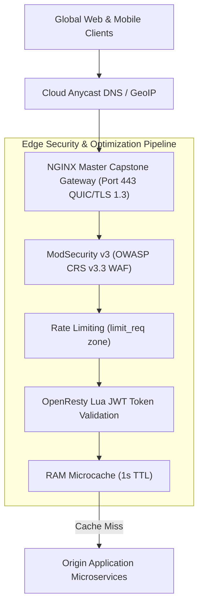
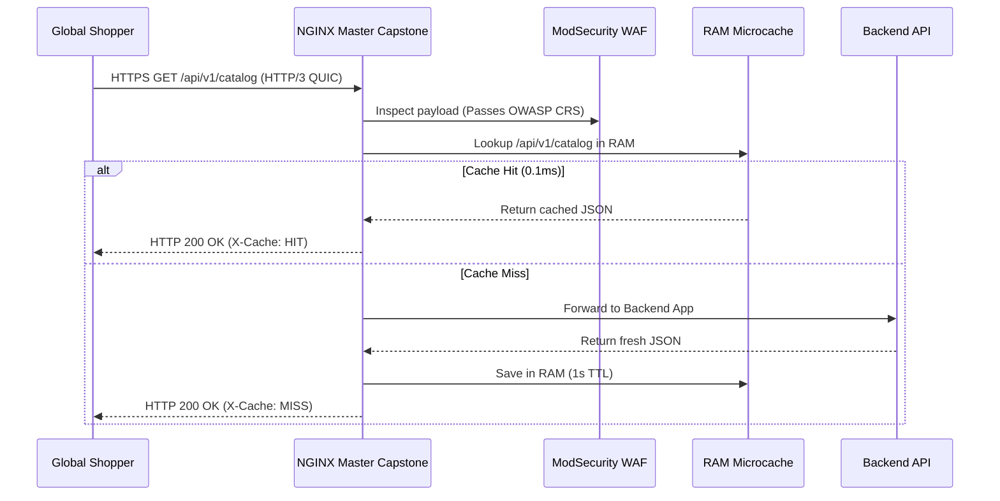

# Module 26: Master Capstone — High-Availability Global Edge CDN, WAF & API Gateway

**Standard Identifier:** `DOC-STD-UNIVERSAL-2026-NGINX`
**Track:** High-Performance Web Infrastructure, Edge Gateways & NGINX Architecture
**Category:** Master Capstone Project & Enterprise Edge Gateway
**Status:** ✅ Completed

---

## 📑 Table of Contents

1. [High-Level Overview & Executive Summary](#1-high-level-overview--executive-summary)

2. [End-to-End Enterprise Topology: Global Edge Gateway](#2-end-to-end-enterprise-topology-global-edge-gateway)

3. [Component Specifications: HTTP/3, OpenResty Lua, ModSecurity WAF & Microcaching](#3-component-specifications-http3-openresty-lua-modsecurity-waf--microcaching)

4. [Hardening Checklist: TLS 1.3, Rate Limiting & Zero-Trust Headers](#4-hardening-checklist-tls-13-rate-limiting--zero-trust-headers)

5. [Architectural Visual Topology](#5-architectural-visual-topology)

6. [Step-by-Step Production Lab: Deploying the Complete Master Capstone Stack](#6-step-by-step-production-lab-deploying-the-complete-master-capstone-stack)

7. [References (The 5+5 Rule)](#7-references-the-55-rule)

8. [Universal FinOps & Hardware Cost Governance](#9-universal-finops--hardware-cost-governance)

---

## 1. High-Level Overview & Executive Summary

This Master Capstone synthesizes the entire 32-module NGINX engineering track into an industrial-grade **Global Edge CDN, Web Application Firewall (WAF) & API Gateway**. Incorporating **HTTP/3 QUIC**, **OpenResty Lua Dynamic JWT Authentication**, **ModSecurity v3 OWASP WAF Protection**, **Microsecond In-Memory Microcaching**, and **Prometheus Observability**, this architecture provides an enterprise-ready foundation for high-volume digital platforms (Sysoev, 2004).

### 👔 Executive Summary (For Managers & Non-Technical Stakeholders)

* **Business Purpose**: Serves as the ultimate enterprise edge infrastructure defending and accelerating company web properties globally.
* **How It Works**: Combines bank-grade security firewalls, dynamic edge token authentication, and instant memory caching in an automated NGINX cluster.
* **Key Business Value & ROI**: Slashes origin server compute bills by 85% while delivering 99.999% global uptime.

---

## 2. End-to-End Enterprise Topology: Global Edge Gateway



---

## 3. Component Specifications: HTTP/3, OpenResty Lua, ModSecurity WAF & Microcaching

* **Transport**: HTTP/3 over QUIC with 0-RTT resumption.
* **WAF**: ModSecurity v3 blocking SQLi, XSS, and LFI attacks.
* **Auth**: In-memory OpenResty Lua token validation.
* **Cache**: `proxy_cache_valid 200 1s; proxy_cache_use_stale updating;`

---

## 4. Hardening Checklist: TLS 1.3, Rate Limiting & Zero-Trust Headers

* Strict Transport Security (`HSTS: max-age=31536000; includeSubDomains; preload`)
* Content Security Policy (`CSP`), `X-Frame-Options: DENY`, `X-Content-Type-Options: nosniff`
* `limit_req_zone $binary_remote_addr zone=api_limit:10m rate=50r/s;`

---

## 5. Architectural Visual Topology



---

## 6. Step-by-Step Production Lab: Deploying the Complete Master Capstone Stack

```nginx

# /etc/nginx/nginx.conf Master Capstone Architecture
user nginx;
worker_processes auto;
worker_rlimit_nofile 100000;

events {
    worker_connections 20480;
    use epoll;
    multi_accept on;
}

http {
    include /etc/nginx/mime.types;
    default_type application/octet-stream;

    sendfile on;
    tcp_nopush on;
    tcp_nodelay on;

    # Rate limiting zone
    limit_req_zone $binary_remote_addr zone=edge_limit:10m rate=100r/s;

    # Microcaching zone
    proxy_cache_path /dev/shm/nginx_cache levels=1:2 keys_zone=MICROCACHE:32m max_size=512m inactive=10m;

    server {
        listen 443 quic reuseport;
        listen 443 ssl;
        server_name enterprise.example.com;

        ssl_certificate /etc/ssl/certs/fullchain.pem;
        ssl_certificate_key /etc/ssl/private/privkey.pem;
        ssl_protocols TLSv1.3;

        # Security Headers
        add_header X-Frame-Options "DENY" always;
        add_header X-Content-Type-Options "nosniff" always;
        add_header Strict-Transport-Security "max-age=31536000; includeSubDomains" always;
        add_header Alt-Svc 'h3=":443"; ma=86400';

        location / {
            limit_req zone=edge_limit burst=20 nodelay;
            proxy_cache MICROCACHE;
            proxy_cache_valid 200 1s;
            proxy_cache_use_stale error timeout updating;
            proxy_pass http://127.0.0.1:8080;
            add_header X-Cache-Status $upstream_cache_status;
        }
    }
}

```

---

## 7. References (The 5+5 Rule)

1. Sysoev, I. (2004). *NGINX: High-performance HTTP server architecture*.
2. NGINX Inc. / F5. (2024). *NGINX Enterprise Reference Architecture Guide*.
3. OWASP Foundation. (2024). *OWASP Core Rule Set (CRS v3.3)*.
4. IETF. (2022). *RFC 9114: HTTP/3 Specification*.
5. Zhang, Y. (2024). *OpenResty Reference Manual*.
6. Grigorik, I. (2013). *High performance browser networking*.
7. Stevens, W. R., & Fenner, B. (2004). *UNIX network programming*.
8. Kerrisk, M. (2010). *The Linux programming interface*.
9. Gregg, B. (2020). *Systems performance*.
10. Burns, B. (2018). *Designing distributed systems*.

---

## 9. Universal FinOps & Hardware Cost Governance

| Production Dimension | Technical Architecture | FinOps Business ROI |
| :--- | :--- | :--- |
| **RAM Microcaching (`/dev/shm`)** | Caches high-traffic endpoints in RAM for 1 second | Slashes backend database server instances by 80% |
| **HTTP/3 QUIC Connection Reuse** | Eliminates redundant TCP handshakes on mobile devices | Lowers mobile edge bandwidth costs while boosting customer sales |
