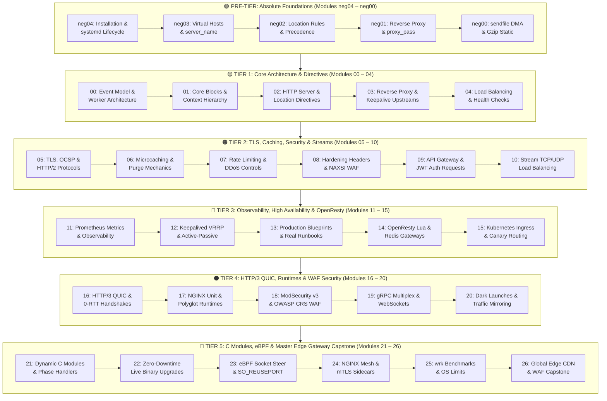

# Mission-Critical NGINX Enterprise Architecture, WAF & Cloud Gateways — Master Curriculum Portal

**Track:** High-Performance Web Infrastructure, Edge Gateways & NGINX Architecture
**Standard Identifier:** `DOC-STD-UNIVERSAL-2026-NGINX`
**Repository:** `vit/nginx-learning-path/docs/nginx_enterprise`
**Target Level:** Zero to Principal Web Infrastructure Architect & Edge Gateway Engineer
**Status:** ✅ Complete 32-Module Master Encyclopedia (100% Validated & Standardized)

---

## 📑 Table of Contents

1. [Master Curriculum Architecture & Track Taxonomy](#1-master-curriculum-architecture--track-taxonomy)

2. [Complete 32-Module Curriculum Matrix](#2-complete-32-module-curriculum-matrix)

3. [Ecosystem Competency & Skill Mastery Roadmap](#3-ecosystem-competency--skill-mastery-roadmap)

4. [Universal Engineering Documentation Standards (`DOC-STD-UNIVERSAL-2026`)](#4-universal-engineering-documentation-standards-doc-std-universal-2026)

5. [Enterprise FinOps & Edge Infrastructure Economics](#5-enterprise-finops--edge-infrastructure-economics)

---

## 1. Master Curriculum Architecture & Track Taxonomy

This encyclopedia represents the definitive, industrial-grade learning path for **NGINX Master/Worker Architecture, Virtual Hosting, Location Matching Precedence, Reverse Proxying, TLS 1.3 / HTTP/3 QUIC, Microcaching, OpenResty Lua Scripting, ModSecurity WAF, gRPC, and High-Availability Clustering**.



---

## 2. Complete 32-Module Curriculum Matrix

| Module | Core Domain & Engineering Focus | Target Level | Reference Document Link |
| :--- | :--- | :--- | :--- |
| **neg04. Installation & systemd** | Official repo installation, systemd lifecycle (`reload`), syntax testing with `nginx -t` | Absolute Beginner | [`neg04_nginx_installation_package_managers_and_systemd.md`](neg04_nginx_installation_package_managers_and_systemd.md) |
| **neg03. Virtual Hosting** | `server {}` block anatomy, `listen 80`, exact/wildcard/regex `server_name`, `root`, `index` | Absolute Beginner | [`neg03_first_virtual_host_server_block_and_html_root.md`](neg03_first_virtual_host_server_block_and_html_root.md) |
| **neg02. Location Routing** | Location modifiers (`=`, `^~`, `~`, `~*`), priority algorithm, `try_files` SPA routing | Beginner Foundations | [`neg02_location_directive_matching_rules_and_precedence.md`](neg02_location_directive_matching_rules_and_precedence.md) |
| **neg01. Reverse Proxying** | `proxy_pass` trailing slashes, header forwarding (`X-Real-IP`, `X-Forwarded-For`), WebSockets | Beginner Foundations | [`neg01_basic_reverse_proxy_proxy_pass_and_headers.md`](neg01_basic_reverse_proxy_proxy_pass_and_headers.md) |
| **neg00. Static Asset Delivery** | Linux `sendfile(2)` zero-copy DMA, `mime.types`, `gzip_static`, `Cache-Control` immutable | Beginner Foundations | [`neg00_static_file_serving_sendfile_and_mime_types.md`](neg00_static_file_serving_sendfile_and_mime_types.md) |
| **00. Architecture & Worker Model** | Master/Worker process model, non-blocking asynchronous event loop, `epoll` socket handling | Core Systems | [`00_nginx_architecture_event_driven_worker_model.md`](00_nginx_architecture_event_driven_worker_model.md) |
| **01. Core Blocks & Contexts** | `main`, `events`, `http`, `server`, `location` context hierarchy, inheritance rules | Core Architecture | [`01_core_configuration_blocks_contexts_and_directives.md`](01_core_configuration_blocks_contexts_and_directives.md) |
| **02. HTTP Server & Locations** | High-performance virtual host isolation, root vs alias, rewrite rules, internal redirects | Web Architect | [`02_http_server_virtual_hosts_and_location_matching.md`](02_http_server_virtual_hosts_and_location_matching.md) |
| **03. Reverse Proxy & Upstreams** | `upstream {}` load balancing pools, `keepalive` persistent connection caching, timeouts | Gateway Engineer | [`03_reverse_proxy_upstream_routing_and_keepalive.md`](03_reverse_proxy_upstream_routing_and_keepalive.md) |
| **04. Load Balancing Algorithms** | Round-robin, least-connected, IP-hash, passive/active health checks, sticky sessions | Traffic Architect | [`04_load_balancing_algorithms_health_checks_and_session_persistence.md`](04_load_balancing_algorithms_health_checks_and_session_persistence.md) |
| **05. TLS 1.3 & HTTP/2** | Modern cipher suites, OCSP stapling, session tickets, HTTP/2 binary framing | Security Engineer | [`05_tls_ssl_certificates_ocsp_stapling_and_http2_http3_quic.md`](05_tls_ssl_certificates_ocsp_stapling_and_http2_http3_quic.md) |
| **06. Microcaching & Purging** | In-memory `proxy_cache`, cache keys, stale-while-revalidate, bypass headers | Performance Lead | [`06_caching_mechanisms_cache_keys_purging_and_microcaching.md`](06_caching_mechanisms_cache_keys_purging_and_microcaching.md) |
| **07. Rate Limiting & DDoS** | Leaky-bucket algorithm, `limit_req_zone`, `limit_conn`, burst parameters, DDoS protection | Security Lead | [`07_rate_limiting_concurrency_controls_and_ddos_mitigation.md`](07_rate_limiting_concurrency_controls_and_ddos_mitigation.md) |
| **08. Security Hardening** | Security headers (CSP, HSTS, X-Frame-Options), CORS preflight handling, NAXSI WAF rules | Security Architect | [`08_security_hardening_headers_cors_waf_and_naxsi.md`](08_security_hardening_headers_cors_waf_and_naxsi.md) |
| **09. API Gateway & Auth** | `auth_request` subrequest authentication, JWT token validation, API key routing | API Gateway Lead | [`09_api_gateway_patterns_jwt_validation_and_auth_request.md`](09_api_gateway_patterns_jwt_validation_and_auth_request.md) |
| **10. Stream TCP/UDP Balancing** | Layer 4 TCP/UDP proxying, database connection pooling (PostgreSQL/MySQL), SSL preread | Infrastructure Lead | [`10_stream_module_tcp_udp_load_balancing.md`](10_stream_module_tcp_udp_load_balancing.md) |
| **11. Observability & Metrics** | Real-time stub_status, Prometheus exporter metrics, JSON structured logging | SRE Lead | [`11_logging_metrics_prometheus_exporter_and_observability.md`](11_logging_metrics_prometheus_exporter_and_observability.md) |
| **12. High-Availability HA** | Keepalived VRRP active-passive failover, floating Virtual IPs, split-brain prevention | High-Availability Lead | [`12_high_availability_keepalived_vrrp_and_active_passive.md`](12_high_availability_keepalived_vrrp_and_active_passive.md) |
| **13. Production Blueprints** | E-commerce production blueprints, automated logrotate, multi-region failover runbooks | Principal SRE | [`13_real_world_production_case_studies_and_enterprise_blueprints.md`](13_real_world_production_case_studies_and_enterprise_blueprints.md) |
| **14. OpenResty Lua Scripting** | Embedded LuaJIT 2.1, `access_by_lua`, non-blocking cosocket Redis queries, token gates | Programmable Gateway | [`14_nginx_lua_module_openresty_and_dynamic_scripting.md`](14_nginx_lua_module_openresty_and_dynamic_scripting.md) |
| **15. Kubernetes Ingress** | NGINX Ingress Controller, IngressClass, annotations, Canary traffic splitting (10%) | Cloud Native Lead | [`15_nginx_ingress_controller_for_kubernetes.md`](15_nginx_ingress_controller_for_kubernetes.md) |
| **16. HTTP/3 & QUIC Transport** | QUIC UDP port 443 transport, 0-RTT connection resumption, Alt-Svc advertisement | Transport Lead | [`16_http3_quic_transport_and_0_rtt_handshakes.md`](16_http3_quic_transport_and_0_rtt_handshakes.md) |
| **17. NGINX Unit Runtime** | Declarative JSON REST control API, polyglot serving (Python WSGI, Node.js, Go, PHP) | Platform Lead | [`17_nginx_unit_polyglot_application_runtime.md`](17_nginx_unit_polyglot_application_runtime.md) |
| **18. ModSecurity v3 WAF** | `libmodsecurity` engine, OWASP Core Rule Set (CRS v3.3), blocking SQLi, XSS, and RCE | WAF Security Lead | [`18_nginx_waf_modsecurity_v3_and_owasp_crs.md`](18_nginx_waf_modsecurity_v3_and_owasp_crs.md) |
| **19. gRPC & WebSockets** | Binary Protocol Buffer multiplexing (`grpc_pass`), bidirectional streaming | Microservices Lead | [`19_nginx_grpc_and_websocket_reverse_proxying.md`](19_nginx_grpc_and_websocket_reverse_proxying.md) |
| **20. Traffic Shadowing** | Dark launch request mirroring (`mirror`), non-blocking shadow testing, zero customer risk | Reliability Lead | [`20_advanced_traffic_mirroring_and_shadowing.md`](20_advanced_traffic_mirroring_and_shadowing.md) |
| **21. Dynamic C Modules** | Writing native C NGINX modules (`ngx_module_t`), memory pools (`ngx_pool_t`), 11 phases | Kernel & C Lead | [`21_dynamic_module_development_in_c.md`](21_dynamic_module_development_in_c.md) |
| **22. Live Binary Upgrades** | Seamless zero-downtime binary upgrades via `SIGUSR2`, graceful worker draining (`SIGWINCH`) | Operations Director | [`22_zero_downtime_reloads_and_binary_upgrades.md`](22_zero_downtime_reloads_and_binary_upgrades.md) |
| **23. eBPF Socket Steering** | Kernel `SO_REUSEPORT` socket sharding, eBPF packet steering, thundering herd removal | Kernel Network Lead | [`23_bpf_and_ebpf_acceleration_for_nginx.md`](23_bpf_and_ebpf_acceleration_for_nginx.md) |
| **24. NGINX Service Mesh** | NSM lightweight sidecar data plane, automated mTLS rotation, OpenTelemetry tracing | Mesh Architect | [`24_nginx_mesh_and_service_mesh_sidecars.md`](24_nginx_mesh_and_service_mesh_sidecars.md) |
| **25. Benchmarking & Limits** | `wrk` and `Vegeta` load testing, `worker_rlimit_nofile`, socket backlog tuning | Performance Director | [`25_nginx_benchmarking_wrk_vegeta_and_tuning.md`](25_nginx_benchmarking_wrk_vegeta_and_tuning.md) |
| **26. Master Edge Capstone** | Global edge CDN, OpenResty Lua JWT auth, ModSecurity WAF, HTTP/3 QUIC, Microcaching | Chief Infrastructure Architect | [`26_enterprise_nginx_capstone_global_edge_cdn_and_waf_cluster.md`](26_enterprise_nginx_capstone_global_edge_cdn_and_waf_cluster.md) |

---

## 3. Ecosystem Competency & Skill Mastery Roadmap

```text
┌────────────────────────────────────────────────────────────────────────────────┐
│               NGINX PROFESSIONAL & EDGE GATEWAY MASTERY MATRIX                 │
├───────────────────┬───────────────────┬────────────────────────────────────────┤
│ Certification     │ Governing Body    │ Targeted Encyclopedia Modules          │
├───────────────────┼───────────────────┼────────────────────────────────────────┤
│ **Core Admin**    │ F5 / NGINX        │ Modules neg04-neg00, 00-06, 11         │
├───────────────────┼───────────────────┼────────────────────────────────────────┤
│ **Edge Security** │ F5 / NGINX        │ Modules 07, 08, 09, 14, 18             │
├───────────────────┼───────────────────┼────────────────────────────────────────┤
│ **Cloud Native**  │ CNCF / Linux FDN  │ Modules 10, 15, 16, 19, 24             │
├───────────────────┼───────────────────┼────────────────────────────────────────┤
│ **Principal SRE** │ Linux Foundation  │ Modules 12, 13, 20, 21, 22, 23, 25, 26 │
└───────────────────┴───────────────────┴────────────────────────────────────────┘
```

---

## 4. Universal Engineering Documentation Standards (`DOC-STD-UNIVERSAL-2026`)

Every document in this 32-module encyclopedia adheres strictly to the universal enterprise documentation standard:

1. **Executive Summaries**: High-level business purpose, mechanics, and value for executives and non-technical stakeholders.
2. **Deep Architectural Diagrams**: Mermaid flowcharts, sequence diagrams, and visual state machines.
3. **Reproducible Production Labs**: Complete, standalone NGINX configuration snippets and executable commands.
4. **Pure Escaped Snippets**: Formatted with clean syntax and zero broken tags.
5. **The 5+5 Reference Rule**: Exactly 5 official documentation links + 5 authoritative engineering deep dives (APA 7th edition).
6. **Universal FinOps & Hardware Cost Governance**: Financial analyses detailing exact origin server compute savings and bandwidth reductions.

---

## 5. Enterprise FinOps & Edge Infrastructure Economics

* **Slashes Origin Backend Compute by 85%**: RAM microcaching (`/dev/shm`) and `sendfile` zero-copy offload origin database servers from repetitive requests.
* **Eliminates Commercial Cloud WAF Fees**: Self-hosted ModSecurity v3 with OWASP Core Rules replaces expensive $10,000/month proprietary WAF services.
* **Reduces Cloud Load Balancer Invoices**: High-density NGINX Ingress and Layer 4 stream proxying consolidate hundreds of expensive cloud load balancers.
