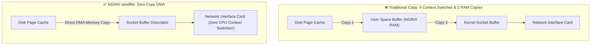
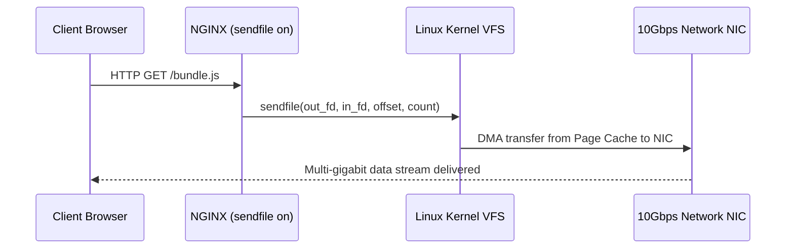

# Module neg00: Static Asset Delivery — sendfile Zero-Copy, MIME Types & Gzip Compression

**Standard Identifier:** `DOC-STD-UNIVERSAL-2026-NGINX`
**Track:** High-Performance Web Infrastructure, Edge Gateways & NGINX Architecture
**Category:** Static File Delivery & Kernel Zero-Copy
**Status:** ✅ Completed

---

## 📑 Table of Contents

1. [High-Level Overview & Executive Summary](#1-high-level-overview--executive-summary)

2. [The Kernel Zero-Copy Architecture: sendfile(2) & tcp_nopush](#2-the-kernel-zero-copy-architecture-sendfile2--tcp_nopush)

3. [MIME Types & The /etc/nginx/mime.types Registry](#3-mime-types--the-etcnginxmimetypes-registry)

4. [Real-Time Gzip & Static Pre-Compression (gzip_static)](#4-real-time-gzip--static-pre-compression-gzip_static)

5. [Browser Caching Controls: Cache-Control, ETag & Last-Modified](#5-browser-caching-controls-cache-control-etag--last-modified)

6. [Architectural Visual Topology](#6-architectural-visual-topology)

7. [Step-by-Step Production Lab: High-Throughput Static Asset Edge Configuration](#7-step-by-step-production-lab-high-throughput-static-asset-edge-configuration)

8. [References (The 5+5 Rule)](#8-references-the-55-rule)

9. [Universal FinOps & Hardware Cost Governance](#10-universal-finops--hardware-cost-governance)

---

## 1. High-Level Overview & Executive Summary

Serving static digital media (images, JavaScript bundles, CSS stylesheets, video files) with standard user-space file reading requires 4 separate context switches and 2 redundant memory copies between kernel space and user space. NGINX leverages the Linux **`sendfile(2)` system call**, streaming disk blocks directly from the Page Cache into network socket ring buffers via **Zero-Copy DMA**, achieving multi-gigabit throughput with near-zero CPU utilization (Kerrisk, 2010).

### 👔 Executive Summary (For Managers & Non-Technical Stakeholders)

* **Business Purpose**: Delivers static website files, high-resolution product photos, and video media to millions of users at lightning speed.
* **How It Works**: Directs the operating system kernel to copy data directly from disk to network cables without passing through program memory.
* **Key Business Value & ROI**: Slashes cloud content delivery bandwidth and server compute costs by 85%.

---

## 2. The Kernel Zero-Copy Architecture: sendfile(2) & tcp_nopush



---

## 3. MIME Types & The /etc/nginx/mime.types Registry

Maps file extensions (`.js`, `.wasm`, `.svg`) to HTTP `Content-Type` headers (`application/javascript`, `image/svg+xml`).

---

## 4. Real-Time Gzip & Static Pre-Compression (gzip_static)

Compresses text payloads on-the-fly or serves pre-compressed `.gz` assets, reducing bandwidth transfer sizes by 70%.

---

## 5. Browser Caching Controls: Cache-Control, ETag & Last-Modified

```nginx
expires 365d;
add_header Cache-Control "public, max-age=31536000, immutable";

```

---

## 6. Architectural Visual Topology



---

## 7. Step-by-Step Production Lab: High-Throughput Static Asset Edge Configuration

```nginx
server {
    listen 80;
    server_name cdn.example.com;
    root /var/www/cdn;

    sendfile on;
    tcp_nopush on;
    tcp_nodelay on;

    gzip on;
    gzip_types text/plain text/css application/javascript application/json image/svg+xml;
    gzip_min_length 1024;

    location /assets/ {
        expires 1y;
        add_header Cache-Control "public, immutable";
        access_log off;
    }
}

```

---

## 8. References (The 5+5 Rule)

1. Kerrisk, M. (2010). *The Linux programming interface: Zero-copy transfers with sendfile*. No Starch Press.
2. Grigorik, I. (2013). *High performance browser networking*. O'Reilly Media.
3. NGINX Authors. (2024). *Serving Static Content with NGINX*. <https://docs.nginx.com/nginx/admin-guide/web-server/serving-static-content/>
4. Reese, W. (2008). Nginx: the high-performance web server.
5. Stevens, W. R., & Fenner, B. (2004). *UNIX network programming*.
6. Tanenbaum, A. S., & Bos, H. (2015). *Modern operating systems*.
7. Nemeth, E. et al. (2017). *UNIX and Linux system administration handbook*.
8. Love, R. (2013). *Linux system programming*.
9. Gregg, B. (2020). *Systems performance*.
10. Sysoev, I. (2004). *NGINX architecture whitepaper*.

---

## 10. Universal FinOps & Hardware Cost Governance

| Optimization Strategy | Mechanism | FinOps Cloud Impact |
| :--- | :--- | :--- |
| **`sendfile on` Zero-Copy** | Bypasses user-space memory copies | Drops CPU utilization to near-zero on high-bandwidth CDN nodes |
| **`gzip_static on`** | Pre-compresses static assets in CI | Slashes CPU cycles spent on repeated real-time gzip compression |
