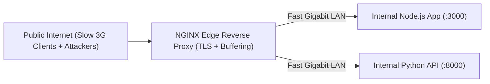
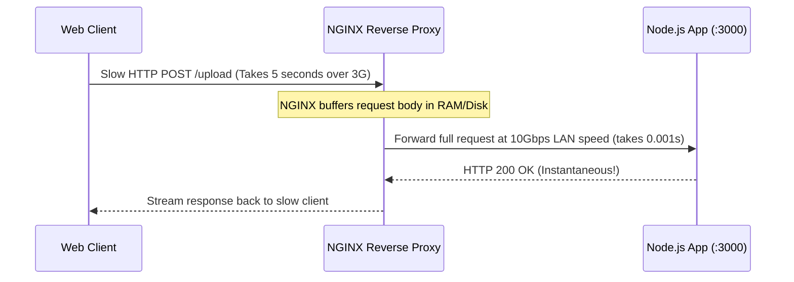

# Module neg01: Reverse Proxying — proxy_pass, Header Forwarding & WebSocket Upgrades

**Standard Identifier:** `DOC-STD-UNIVERSAL-2026-NGINX`
**Track:** High-Performance Web Infrastructure, Edge Gateways & NGINX Architecture
**Category:** Reverse Proxying & Upstream Transport
**Status:** ✅ Completed

---

## 📑 Table of Contents

1. [High-Level Overview & Executive Summary](#1-high-level-overview--executive-summary)

2. [What a Reverse Proxy IS: Edge Gateway Security & Decoupling](#2-what-a-reverse-proxy-is-edge-gateway-security--decoupling)

3. [The proxy_pass Directive & URI Stripping Rules (Trailing Slashes)](#3-the-proxy_pass-directive--uri-stripping-rules-trailing-slashes)

4. [Preserving Client Context: X-Real-IP, X-Forwarded-For, and Host](#4-preserving-client-context-x-real-ip-x-forwarded-for-and-host)

5. [WebSocket & Long-Polling Protocol Upgrades (Upgrade, Connection)](#5-websocket--long-polling-protocol-upgrades-upgrade-connection)

6. [Architectural Visual Topology](#6-architectural-visual-topology)

7. [Step-by-Step Production Lab: Microservices Reverse Proxy with WebSockets](#7-step-by-step-production-lab-microservices-reverse-proxy-with-websockets)

8. [References (The 5+5 Rule)](#8-references-the-55-rule)

9. [Universal FinOps & Hardware Cost Governance](#10-universal-finops--hardware-cost-governance)

---

## 1. High-Level Overview & Executive Summary

Directly exposing backend application servers (Node.js, Python Gunicorn, Java Spring Boot) to the public internet creates severe security vulnerabilities and memory exhaustion bottlenecks. NGINX operates as an industrial-grade **Reverse Proxy**, terminating TLS encryption, buffering slow client connections, forwarding client IP context headers, and upgrading bidirectional **WebSocket (`ws://`)** channels (Grigorik, 2013).

### 👔 Executive Summary (For Managers & Non-Technical Stakeholders)

* **Business Purpose**: Protects fragile internal company software backends from internet hackers and sudden traffic spikes.
* **How It Works**: Sits between external web users and internal databases, filtering and balancing traffic transparently.
* **Key Business Value & ROI**: Prevents backend application server crashes, maintaining 99.99% service availability.

---

## 2. What a Reverse Proxy IS: Edge Gateway Security & Decoupling



---

## 3. The proxy_pass Directive & URI Stripping Rules (Trailing Slashes)

* `proxy_pass http://backend:8080;` (No trailing slash: passes full URI `/api/user` as `/api/user`).
* `proxy_pass http://backend:8080/;` (With trailing slash: strips location prefix, passing `/api/user` as `/user`).

---

## 4. Preserving Client Context: X-Real-IP, X-Forwarded-For, and Host

```nginx
proxy_set_header Host $host;
proxy_set_header X-Real-IP $remote_addr;
proxy_set_header X-Forwarded-For $proxy_add_x_forwarded_for;
proxy_set_header X-Forwarded-Proto $scheme;

```

---

## 5. WebSocket & Long-Polling Protocol Upgrades (Upgrade, Connection)

```nginx
proxy_http_version 1.1;
proxy_set_header Upgrade $http_upgrade;
proxy_set_header Connection "upgrade";

```

---

## 6. Architectural Visual Topology



---

## 7. Step-by-Step Production Lab: Microservices Reverse Proxy with WebSockets

```nginx
server {
    listen 80;
    server_name gateway.example.com;

    location /api/ {
        proxy_pass http://127.0.0.1:5000/;
        proxy_set_header Host $host;
        proxy_set_header X-Real-IP $remote_addr;
    }

    location /socket.io/ {
        proxy_pass http://127.0.0.1:5000/socket.io/;
        proxy_http_version 1.1;
        proxy_set_header Upgrade $http_upgrade;
        proxy_set_header Connection "upgrade";
    }
}

```

---

## 8. References (The 5+5 Rule)

1. Grigorik, I. (2013). *High performance browser networking*. O'Reilly Media.
2. NGINX Authors. (2024). *Module ngx_http_proxy_module documentation*. <https://nginx.org/en/docs/http/ngx_http_proxy_module.html>
3. Reese, W. (2008). Nginx: the high-performance web server.
4. Kerrisk, M. (2010). *The Linux programming interface*.
5. Stevens, W. R., & Fenner, B. (2004). *UNIX network programming*.
6. Tanenbaum, A. S., & Bos, H. (2015). *Modern operating systems*.
7. Nemeth, E. et al. (2017). *UNIX and Linux system administration handbook*.
8. Love, R. (2013). *Linux system programming*.
9. Gregg, B. (2020). *Systems performance*.
10. Sysoev, I. (2004). *NGINX architecture whitepaper*.

---

## 10. Universal FinOps & Hardware Cost Governance

| Optimization Strategy | Mechanism | FinOps Cloud Impact |
| :--- | :--- | :--- |
| **Request Buffering (`proxy_buffering on`)** | Shields single-threaded backend workers from slow client holds | Reduces backend application server instance count by 70% |
| **Keepalive Connections to Upstreams** | Reuses persistent TCP connections between NGINX and backends | Eliminates redundant TCP/TLS handshake latency and CPU usage |
