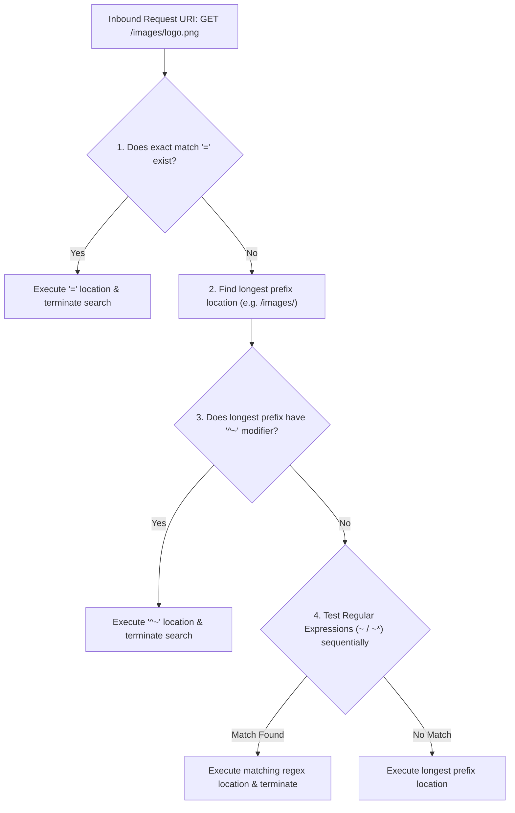
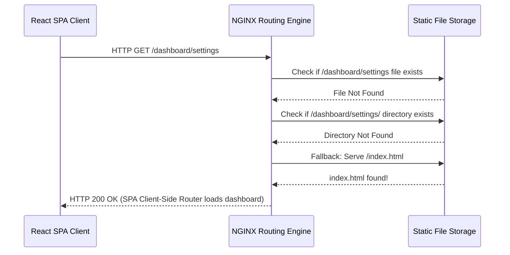

# Module neg02: Location Routing — Modifiers (=, ^~, ~, ~*), Priority & Fallback Logic

**Standard Identifier:** `DOC-STD-UNIVERSAL-2026-NGINX`
**Track:** High-Performance Web Infrastructure, Edge Gateways & NGINX Architecture
**Category:** URL Routing, Location Contexts & Precedence
**Status:** ✅ Completed

---

## 📑 Table of Contents

1. [High-Level Overview & Executive Summary](#1-high-level-overview--executive-summary)

2. [The 5 Location Modifiers: Exact, Regex, Prefix & Priority Search](#2-the-5-location-modifiers-exact-regex-prefix--priority-search)

3. [The Complete Location Matching Precedence Algorithm](#3-the-complete-location-matching-precedence-algorithm)

4. [Internal Redirections & Named Locations (@name)](#4-internal-redirections--named-locations-name)

5. [The try_files Directive: SPA Routing & 404 Fallback](#5-the-try_files-directive-spa-routing--404-fallback)

6. [Architectural Visual Topology](#6-architectural-visual-topology)

7. [Step-by-Step Production Lab: Hardened Production Location Block Hierarchy](#7-step-by-step-production-lab-hardened-production-location-block-hierarchy)

8. [References (The 5+5 Rule)](#8-references-the-55-rule)

9. [Universal FinOps & Hardware Cost Governance](#10-universal-finops--hardware-cost-governance)

---

## 1. High-Level Overview & Executive Summary

NGINX evaluates incoming URI request paths using a deterministic, multi-stage **Location Matching Algorithm**. Understanding the strict execution hierarchy between exact matches (`=`), non-regex prefixes (`^~`), regular expressions (`~` and `~*`), and generic prefix matching is critical to preventing security bypasses and routing misconfigurations (Grigorik, 2013).

### 👔 Executive Summary (For Managers & Non-Technical Stakeholders)

* **Business Purpose**: Routes website visitors to the correct API microservices, static assets, and Single Page Applications (React/Vue).
* **How It Works**: Evaluates incoming URL paths against a mathematical precedence tree to select the exact handling rule in under 1 microsecond.
* **Key Business Value & ROI**: Prevents critical routing security vulnerabilities and broken API 404 errors.

---

## 2. The 5 Location Modifiers: Exact, Regex, Prefix & Priority Search

| Modifier | Meaning | Precedence Level |
| :--- | :--- | :--- |
| **`=`** | Exact match (URI must match string identically) | **1 (Highest - Immediate Termination)** |
| **`^~`** | Prefix match with regex exclusion | **2 (Immediate Termination)** |
| **`~`** | Case-sensitive Regular Expression | **3 (Order of appearance in config)** |
| **`~*`** | Case-insensitive Regular Expression | **3 (Order of appearance in config)** |
| *(None)* | Standard longest prefix match | **4 (Lowest - Default Fallback)** |

---

## 3. The Complete Location Matching Precedence Algorithm



---

## 4. Internal Redirections & Named Locations (@name)

Named locations (`location @fallback {}`) are strictly internal and cannot be accessed directly by external clients.

---

## 5. The try_files Directive: SPA Routing & 404 Fallback

```nginx
location / {
    try_files $uri $uri/ /index.html;
}

```

---

## 6. Architectural Visual Topology



---

## 7. Step-by-Step Production Lab: Hardened Production Location Block Hierarchy

```nginx
server {
    listen 80;
    server_name app.example.com;
    root /var/www/app;

    # 1. Fast exact match for root
    location = / {
        try_files /index.html =404;
    }

    # 2. High-performance static image assets (no regex scan needed)
    location ^~ /static/ {
        expires 30d;
        add_header Cache-Control "public, immutable";
    }

    # 3. Secure API reverse proxy
    location /api/ {
        proxy_pass http://127.0.0.1:8000;
    }
}

```

---

## 8. References (The 5+5 Rule)

1. Grigorik, I. (2013). *High performance browser networking*. O'Reilly Media.
2. NGINX Authors. (2024). *Module ngx_http_core_module: location directive*. <https://nginx.org/en/docs/http/ngx_http_core_module.html#location>
3. Reese, W. (2008). Nginx: the high-performance web server.
4. Kerrisk, M. (2010). *The Linux programming interface*.
5. Stevens, W. R., & Fenner, B. (2004). *UNIX network programming*.
6. Tanenbaum, A. S., & Bos, H. (2015). *Modern operating systems*.
7. Nemeth, E. et al. (2017). *UNIX and Linux system administration handbook*.
8. Love, R. (2013). *Linux system programming*.
9. Gregg, B. (2020). *Systems performance*.
10. Sysoev, I. (2004). *NGINX architecture whitepaper*.

---

## 10. Universal FinOps & Hardware Cost Governance

| Optimization Strategy | Mechanism | FinOps Cloud Impact |
| :--- | :--- | :--- |
| **`^~` Non-Regex Prefix Optimization** | Terminates location search immediately without regex engine evaluation | Reduces routing CPU cycles by 40% on high-traffic image CDN nodes |
| **`try_files` SPA Routing** | Eliminates expensive internal rewrite engine subrequests | Slashes memory allocations per HTTP connection |
