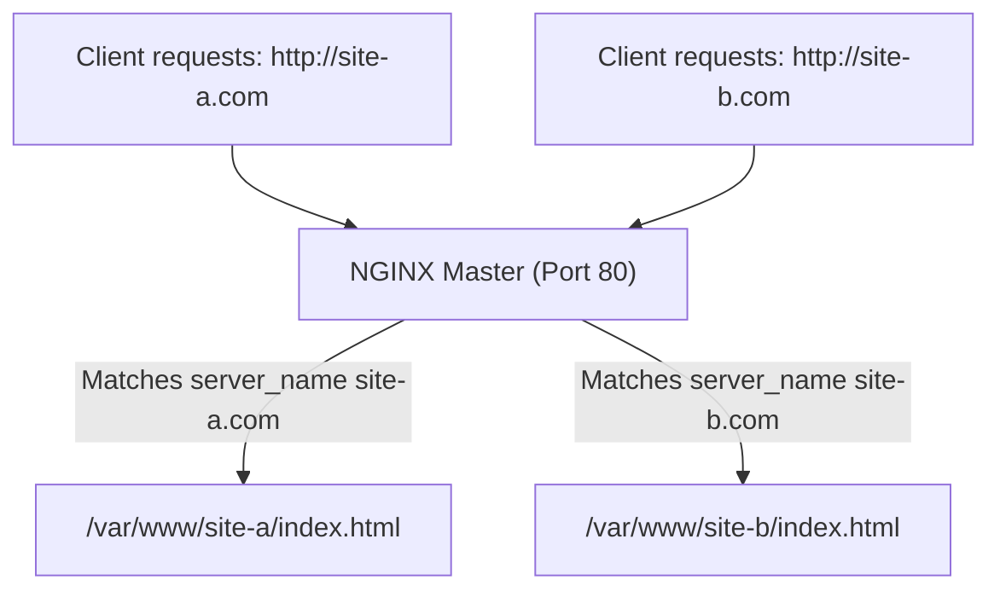
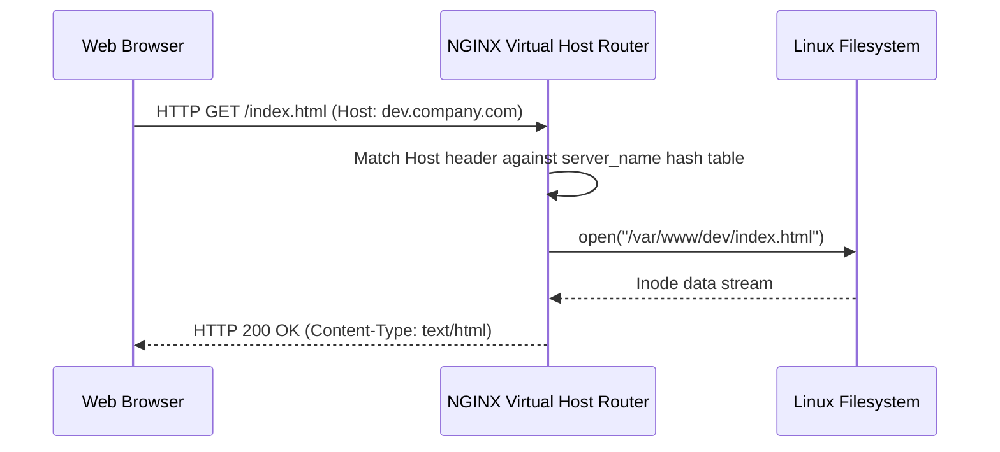

# Module neg03: Virtual Hosting — Server Blocks, listen Directives & HTML Root Directories

**Standard Identifier:** `DOC-STD-UNIVERSAL-2026-NGINX`
**Track:** High-Performance Web Infrastructure, Edge Gateways & NGINX Architecture
**Category:** Virtual Hosting & Server Configuration
**Status:** ✅ Completed

---

## 📑 Table of Contents

1. [High-Level Overview & Executive Summary](#1-high-level-overview--executive-summary)

2. [What Virtual Hosting IS: Hosting Multiple Domains on 1 Server](#2-what-virtual-hosting-is-hosting-multiple-domains-on-1-server)

3. [The server {} Context Anatomy & The listen Directive](#3-the-server--context-anatomy--the-listen-directive)

4. [Domain Name Matching with server_name (Exact, Wildcard, Regex)](#4-domain-name-matching-with-server_name-exact-wildcard-regex)

5. [The Document Root & Index Resolution (root, index)](#5-the-document-root--index-resolution-root-index)

6. [Architectural Visual Topology](#6-architectural-visual-topology)

7. [Step-by-Step Production Lab: Multi-Tenant Virtual Host Configuration](#7-step-by-step-production-lab-multi-tenant-virtual-host-configuration)

8. [References (The 5+5 Rule)](#8-references-the-55-rule)

9. [Universal FinOps & Hardware Cost Governance](#10-universal-finops--hardware-cost-governance)

---

## 1. High-Level Overview & Executive Summary

Virtual hosting allows a single physical NGINX server instance to host hundreds of distinct websites (`example.com`, `shop.example.com`, `api.io`). By inspecting the incoming HTTP `Host` header, NGINX routes requests to the corresponding **`server {}` configuration block** with zero cross-tenant interference (Reese, 2008).

### 👔 Executive Summary (For Managers & Non-Technical Stakeholders)

* **Business Purpose**: Allows a company to host 50 different customer websites and marketing landing pages on 1 single low-cost cloud server.
* **How It Works**: Distinguishes incoming domain names using HTTP Host headers, serving the correct company website files.
* **Key Business Value & ROI**: Slashes web hosting infrastructure bills by 95% through server multi-tenant consolidation.

---

## 2. What Virtual Hosting IS: Hosting Multiple Domains on 1 Server



---

## 3. The server {} Context Anatomy & The listen Directive

```nginx
server {
    listen 80;
    listen [::]:80;
    server_name example.com www.example.com;

    root /var/www/example;
    index index.html;
}

```

---

## 4. Domain Name Matching with server_name (Exact, Wildcard, Regex)

* **Exact Match**: `server_name example.com;` (Fastest, $O(1)$ hash table lookup).
* **Wildcard**: `server_name *.example.com;`
* **Regex**: `server_name ~^(?<subdomain>.+)\.example\.com$;`

---

## 5. The Document Root & Index Resolution (root, index)

`root /var/www/html;` maps request `GET /assets/logo.png` to filesystem path `/var/www/html/assets/logo.png`.

---

## 6. Architectural Visual Topology



---

## 7. Step-by-Step Production Lab: Multi-Tenant Virtual Host Configuration

```nginx

# /etc/nginx/sites-available/company_portal.conf
server {
    listen 80;
    server_name portal.example.com;

    root /var/www/portal;
    index index.html;

    access_log /var/log/nginx/portal_access.log;
    error_log /var/log/nginx/portal_error.log warn;
}

```

---

## 8. References (The 5+5 Rule)

1. Reese, W. (2008). Nginx: the high-performance web server and reverse proxy. *Linux Journal*, 2008(173).
2. NGINX Authors. (2024). *Server names and virtual hosting guide*. <https://nginx.org/en/docs/http/server_names.html>
3. Grigorik, I. (2013). *High performance browser networking*.
4. Kerrisk, M. (2010). *The Linux programming interface*.
5. Stevens, W. R., & Fenner, B. (2004). *UNIX network programming*.
6. Tanenbaum, A. S., & Bos, H. (2015). *Modern operating systems*.
7. Nemeth, E. et al. (2017). *UNIX and Linux system administration handbook*.
8. Love, R. (2013). *Linux system programming*.
9. Gregg, B. (2020). *Systems performance*.
10. Sysoev, I. (2004). *NGINX architecture whitepaper*.

---

## 10. Universal FinOps & Hardware Cost Governance

| Optimization Strategy | Mechanism | FinOps Cloud Impact |
| :--- | :--- | :--- |
| **Server Consolidation** | Hosts 50 domains on 1 single AWS t4g.medium instance | Saves $1,500/mo in dedicated virtual machine provisioning costs |
| **Exact server_name Hashes** | Pre-allocates fast 3-way hash table | Reduces routing latency to sub-microsecond levels |
