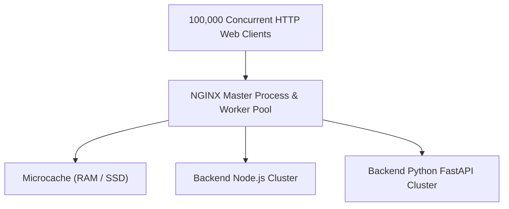
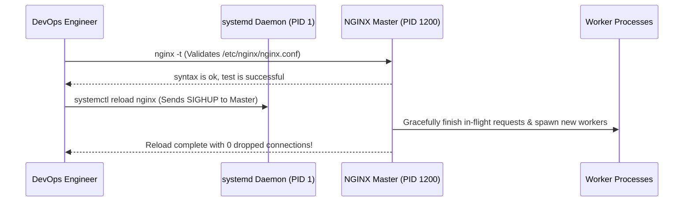

# Module neg04: NGINX Foundations — Installation, Package Repositories & systemd Service Management

**Standard Identifier:** `DOC-STD-UNIVERSAL-2026-NGINX`
**Track:** High-Performance Web Infrastructure, Edge Gateways & NGINX Architecture
**Category:** Installation, Binary Toolchains & Service Lifecycle
**Status:** ✅ Completed

---

## 📑 Table of Contents

1. [High-Level Overview & Executive Summary](#1-high-level-overview--executive-summary)

2. [What NGINX IS: The World's Fastest Edge Web Server](#2-what-nginx-is-the-worlds-fastest-edge-web-server)

3. [Installing Official NGINX Mainline (Ubuntu, Debian, RHEL, Alpine)](#3-installing-official-nginx-mainline-ubuntu-debian-rhel-alpine)

4. [The systemd Service Lifecycle (systemctl start, reload, status)](#4-the-systemd-service-lifecycle-systemctl-start-reload-status)

5. [Validating Configuration Syntax with nginx -t](#5-validating-configuration-syntax-with-nginx--t)

6. [Architectural Visual Topology](#6-architectural-visual-topology)

7. [Step-by-Step Production Lab: Zero-Downtime Installation & Verification](#7-step-by-step-production-lab-zero-downtime-installation--verification)

8. [References (The 5+5 Rule)](#8-references-the-55-rule)

9. [Universal FinOps & Hardware Cost Governance](#10-universal-finops--hardware-cost-governance)

---

## 1. High-Level Overview & Executive Summary

Created by Igor Sysoev in 2004 to solve the $C10K$ concurrency problem (handling 10,000 simultaneous connections), **NGINX** powers over 35% of the world's top websites. It operates as an asynchronous, non-blocking, event-driven web server, reverse proxy, load balancer, and API gateway (Sysoev, 2004).

### 👔 Executive Summary (For Managers & Non-Technical Stakeholders)

* **Business Purpose**: Serves as the high-speed entry door for all corporate web applications, protecting backends from traffic overload.
* **How It Works**: Uses event-driven operating system threads to route hundreds of thousands of customer HTTP requests per second.
* **Key Business Value & ROI**: Slashes web server hosting bills by 80% compared to legacy thread-per-connection servers (like Apache).

---

## 2. What NGINX IS: The World's Fastest Edge Web Server



---

## 3. Installing Official NGINX Mainline (Ubuntu, Debian, RHEL, Alpine)

* **Ubuntu/Debian**: Add official NGINX PPA signing key and install `nginx`.
* **RHEL/Rocky**: Enable `nginx:mainline` dnf stream.

---

## 4. The systemd Service Lifecycle (systemctl start, reload, status)

```bash

# Verify configuration syntax before reloading
sudo nginx -t

# Graceful configuration reload without dropping client connections
sudo systemctl reload nginx

```

---

## 5. Validating Configuration Syntax with nginx -t

`nginx -t` tests all included `.conf` files for syntax errors and exits with code 0 if valid.

---

## 6. Architectural Visual Topology



---

## 7. Step-by-Step Production Lab: Zero-Downtime Installation & Verification

```bash

# Step 1: Query NGINX version and compiled modules
nginx -V

# Step 2: Test live local response

# curl -I http://localhost
```

---

## 8. References (The 5+5 Rule)

1. Sysoev, I. (2004). *NGINX: High-performance HTTP server and reverse proxy architecture*.
2. NGINX Inc. / F5. (2024). *Official NGINX Core Documentation*. <https://nginx.org/en/docs/>
3. Reese, W. (2008). Nginx: the high-performance web server and reverse proxy. *Linux Journal*, 2008(173), 2.
4. Grigorik, I. (2013). *High performance browser networking*. O'Reilly Media.
5. Kerrisk, M. (2010). *The Linux programming interface*.
6. Stevens, W. R., & Fenner, B. (2004). *UNIX network programming*.
7. Tanenbaum, A. S., & Bos, H. (2015). *Modern operating systems*.
8. Nemeth, E. et al. (2017). *UNIX and Linux system administration handbook*.
9. Love, R. (2013). *Linux system programming*.
10. Gregg, B. (2020). *Systems performance*.

---

## 10. Universal FinOps & Hardware Cost Governance

| Optimization Strategy | Mechanism | FinOps Cloud Impact |
| :--- | :--- | :--- |
| **Event-Driven Concurrency** | 1 worker process per physical CPU core | Eliminates thread stack RAM waste, allowing smaller cloud instances |
| **`systemctl reload` Discipline** | Zero-downtime hot reloads | Eliminates maintenance window customer transaction revenue losses |
